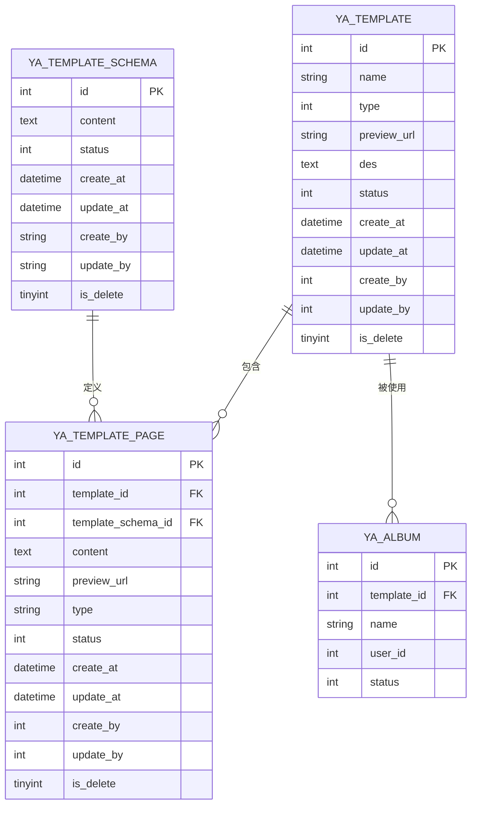
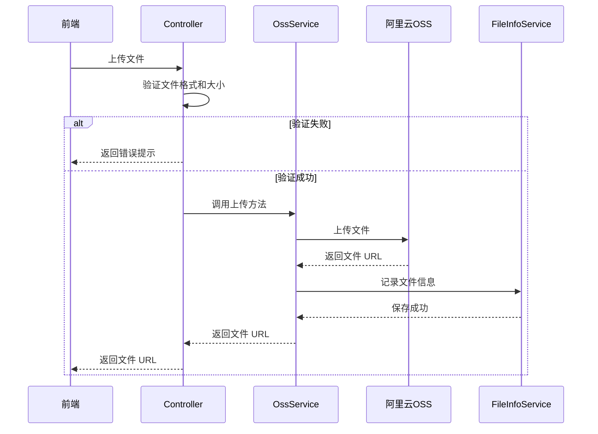

# 技术设计文档 - 管理端模板管理功能

## Overview

本设计文档描述了 YearArk 纪念册系统管理端的模板管理功能的技术实现方案。该功能为管理员提供完整的模板套件（YaTemplate）、模板页面（YaTemplatePage）和 JSON Schema（YaTemplateSchema）的增删改查能力。

### 功能范围

1. **模板套件管理**: 创建、编辑、删除、查询模板套件，支持预览图上传和状态管理
2. **模板页面管理**: 在模板详情页中管理模板页面，支持 H5 模板字符串编辑和单页预览
3. **JSON Schema 管理**: 管理占位区域配置，支持 JSON 编辑器和格式验证

### 技术栈

- **后端框架**: RuoYi-AI (Spring Boot 3.4 + MyBatis-Plus)
- **前端框架**: Vue3 + TypeScript + Ant Design Vue (Vben Admin)
- **数据库**: MySQL 8.0.44
- **文件存储**: 阿里云 OSS
- **权限管理**: Sa-Token

### 设计目标

1. 提供直观的模板管理界面，支持嵌套的模板页面管理
2. 确保数据完整性，防止删除被使用的模板和 Schema
3. 支持文件上传到 OSS，统一管理预览图资源
4. 提供代码编辑器和 JSON 编辑器，提升编辑体验
5. 记录操作日志，支持审计追踪

## Architecture

### 系统架构


```
┌─────────────────────────────────────────────────────────────┐
│                    管理端前端 (Vue3 + Ant Design Vue)          │
│  ┌──────────────┐  ┌──────────────┐  ┌──────────────┐      │
│  │ 模板列表页    │  │ 模板详情页    │  │ Schema管理页  │      │
│  │ - 查询筛选    │  │ - 基本信息    │  │ - JSON编辑   │      │
│  │ - 新增编辑    │  │ - 模板页列表  │  │ - 格式验证   │      │
│  │ - 删除操作    │  │ - 页面管理    │  │ - 增删改查   │      │
│  └──────────────┘  └──────────────┘  └──────────────┘      │
└─────────────────────────────────────────────────────────────┘
                            │ HTTP/JSON
                            ▼
┌─────────────────────────────────────────────────────────────┐
│              Java 后端 (Spring Boot + MyBatis-Plus)          │
│  ┌──────────────────────────────────────────────────────┐   │
│  │                    Controller 层                      │   │
│  │  YaTemplateController | YaTemplatePageController |   │   │
│  │  YaTemplateSchemaController                          │   │
│  └──────────────────────────────────────────────────────┘   │
│                            │                                 │
│  ┌──────────────────────────────────────────────────────┐   │
│  │                     Service 层                        │   │
│  │  IYaTemplateService | IYaTemplatePageService |       │   │
│  │  IYaTemplateSchemaService                            │   │
│  └──────────────────────────────────────────────────────┘   │
│                            │                                 │
│  ┌──────────────────────────────────────────────────────┐   │
│  │                     Mapper 层                         │   │
│  │  YaTemplateMapper | YaTemplatePageMapper |           │   │
│  │  YaTemplateSchemaMapper                              │   │
│  └──────────────────────────────────────────────────────┘   │
└─────────────────────────────────────────────────────────────┘
                            │
                            ▼
┌─────────────────────────────────────────────────────────────┐
│                      MySQL 8.0.44                            │
│  ya_template | ya_template_page | ya_template_schema        │
└─────────────────────────────────────────────────────────────┘
                            │
                            ▼
┌─────────────────────────────────────────────────────────────┐
│                      阿里云 OSS                               │
│  模板预览图 | 页面预览图                                      │
└─────────────────────────────────────────────────────────────┘
```

### 分层设计

#### Controller 层
- 负责接收 HTTP 请求，参数验证
- 调用 Service 层业务逻辑
- 返回统一的响应格式 (R<T> 或 TableDataInfo<T>)
- 处理异常并返回友好的错误信息

#### Service 层
- 实现核心业务逻辑
- 数据验证（外键关联、业务规则）
- 调用 Mapper 层进行数据库操作
- 处理文件上传到 OSS
- 记录操作日志

#### Mapper 层
- 使用 MyBatis-Plus 进行数据库操作
- 支持 LambdaQueryWrapper 构建动态查询
- 自动填充 createAt、updateAt 字段
- 支持逻辑删除

### 路由设计

#### 前端路由

```
/yearark/template                    # 模板套件列表页
  ├─ /yearark/template/detail/:id    # 模板套件详情页（含模板页管理）
  └─ /yearark/template-schema        # JSON Schema 管理页
```

#### 后端 API 路由

**模板套件 API**
```
GET    /yearark/template/page        # 分页查询模板列表
GET    /yearark/template/list        # 查询模板列表（不分页）
GET    /yearark/template/{id}        # 获取模板详情
POST   /yearark/template             # 新增模板
POST   /yearark/template/update      # 修改模板
DELETE /yearark/template/{ids}       # 删除模板（支持批量）
```

**模板页面 API**
```
GET    /yearark/template-page/page   # 分页查询模板页面列表
GET    /yearark/template-page/list   # 查询模板页面列表（不分页）
GET    /yearark/template-page/{id}   # 获取模板页面详情
POST   /yearark/template-page        # 新增模板页面
POST   /yearark/template-page/update # 修改模板页面
DELETE /yearark/template-page/{ids}  # 删除模板页面（支持批量）
```

**JSON Schema API**
```
GET    /yearark/template-schema/page   # 分页查询 Schema 列表
GET    /yearark/template-schema/list   # 查询 Schema 列表（不分页）
GET    /yearark/template-schema/{id}   # 获取 Schema 详情
POST   /yearark/template-schema        # 新增 Schema
POST   /yearark/template-schema/update # 修改 Schema
DELETE /yearark/template-schema/{ids}  # 删除 Schema（支持批量）
```

## Components and Interfaces


### 后端组件

#### 1. Controller 组件

**YaTemplateController**
- 职责: 处理模板套件相关的 HTTP 请求
- 依赖: IYaTemplateService, IYaAlbumService
- 关键方法:
  - `page()`: 分页查询模板列表
  - `list()`: 查询模板列表（不分页）
  - `info()`: 获取模板详情
  - `insert()`: 新增模板
  - `update()`: 修改模板
  - `delete()`: 删除模板（检查是否被纪念册使用）

**YaTemplatePageController**
- 职责: 处理模板页面相关的 HTTP 请求
- 依赖: IYaTemplatePageService
- 关键方法:
  - `page()`: 分页查询模板页面列表
  - `list()`: 查询模板页面列表（不分页）
  - `info()`: 获取模板页面详情
  - `insert()`: 新增模板页面
  - `update()`: 修改模板页面
  - `delete()`: 删除模板页面

**YaTemplateSchemaController**
- 职责: 处理 JSON Schema 相关的 HTTP 请求
- 依赖: IYaTemplateSchemaService
- 关键方法:
  - `page()`: 分页查询 Schema 列表
  - `list()`: 查询 Schema 列表（不分页）
  - `info()`: 获取 Schema 详情
  - `insert()`: 新增 Schema
  - `update()`: 修改 Schema
  - `delete()`: 删除 Schema（检查是否被模板页面引用）

#### 2. Service 组件

**IYaTemplateService**
- 职责: 模板套件业务逻辑
- 关键方法:
  - `queryPage()`: 分页查询，支持名称模糊搜索、类型筛选、状态筛选
  - `queryList()`: 列表查询
  - `queryById()`: 根据 ID 查询详情
  - `insertByDto()`: 新增模板，自动填充创建时间和创建人
  - `updateByDto()`: 更新模板，自动填充修改时间和修改人
  - `deleteByIds()`: 批量删除，执行逻辑删除

**IYaTemplatePageService**
- 职责: 模板页面业务逻辑
- 关键方法:
  - `queryPage()`: 分页查询，支持按模板 ID 和页面类型筛选
  - `queryList()`: 列表查询
  - `queryById()`: 根据 ID 查询详情
  - `insertByDto()`: 新增模板页面，验证模板 ID 和 Schema ID 的有效性
  - `updateByDto()`: 更新模板页面
  - `deleteByIds()`: 批量删除

**IYaTemplateSchemaService**
- 职责: JSON Schema 业务逻辑
- 关键方法:
  - `queryPage()`: 分页查询，支持按状态筛选
  - `queryList()`: 列表查询
  - `queryById()`: 根据 ID 查询详情
  - `insertByDto()`: 新增 Schema，验证 JSON 格式
  - `updateByDto()`: 更新 Schema，验证 JSON 格式
  - `deleteByIds()`: 批量删除，检查是否被模板页面引用
  - `validateJson()`: 验证 JSON 格式的有效性

#### 3. 文件上传组件

**OssService**
- 职责: 处理文件上传到阿里云 OSS
- 关键方法:
  - `upload()`: 上传文件到 OSS，返回文件 URL
  - `validateFile()`: 验证文件格式和大小
  - `delete()`: 删除 OSS 文件

### 前端组件

#### 1. 模板列表页组件

**TemplateList.vue**
- 职责: 展示模板套件列表，提供查询、新增、编辑、删除功能
- 子组件:
  - `TemplateSearchForm`: 搜索表单（名称、类型、状态）
  - `TemplateTable`: 模板列表表格
  - `TemplateModal`: 新增/编辑模板弹窗
- 关键功能:
  - 分页查询模板列表
  - 按名称模糊搜索
  - 按类型和状态筛选
  - 新增/编辑模板（含预览图上传）
  - 批量删除模板
  - 跳转到模板详情页

#### 2. 模板详情页组件

**TemplateDetail.vue**
- 职责: 展示模板套件详情和管理模板页面
- 布局:
  - 顶部: 模板基本信息（名称、类型、预览图、描述、状态）
  - 中部: 使用统计（被多少个纪念册使用）
  - 下部: 模板页面列表（嵌套管理）
- 子组件:
  - `TemplateInfo`: 模板基本信息展示
  - `TemplatePageList`: 模板页面列表
  - `TemplatePageModal`: 新增/编辑模板页面弹窗
  - `CodeEditor`: H5 模板字符串编辑器
- 关键功能:
  - 加载模板详情
  - 查询该模板下的所有模板页面
  - 新增/编辑/删除模板页面
  - H5 模板字符串编辑（代码高亮）
  - 关联 Schema 选择

#### 3. Schema 管理页组件

**SchemaList.vue**
- 职责: 展示 JSON Schema 列表，提供增删改查功能
- 子组件:
  - `SchemaTable`: Schema 列表表格
  - `SchemaModal`: 新增/编辑 Schema 弹窗
  - `JsonEditor`: JSON 编辑器
- 关键功能:
  - 分页查询 Schema 列表
  - 按状态筛选
  - 新增/编辑 Schema（JSON 编辑器）
  - JSON 格式验证
  - 批量删除 Schema

### 接口定义

#### DTO (Data Transfer Object)

**YaTemplateDto**
```java
{
  id: Integer,           // 模板 ID（更新时必填）
  name: String,          // 模板名称（必填）
  type: Integer,         // 模板类型（必填，字典值）
  previewUrl: String,    // 预览图 URL
  des: String,           // 描述
  status: Integer        // 状态（0禁用/1启用）
}
```

**YaTemplatePageDto**
```java
{
  id: Integer,              // 模板页面 ID（更新时必填）
  templateId: Integer,      // 关联模板 ID（必填）
  templateSchemaId: Integer,// 关联 Schema ID
  content: String,          // H5 模板字符串（必填）
  previewUrl: String,       // 单页预览 URL
  type: String,             // 页面类型（必填）
  status: Integer           // 状态
}
```

**YaTemplateSchemaDto**
```java
{
  id: Integer,           // Schema ID（更新时必填）
  content: String,       // JSON Schema 内容（必填）
  status: Integer        // 状态
}
```

#### VO (View Object)

**YaTemplateVo**
```java
{
  id: Integer,
  name: String,
  type: Integer,
  typeName: String,      // 类型中文名称（从字典翻译）
  previewUrl: String,
  des: String,
  status: Integer,
  createAt: LocalDateTime,
  updateAt: LocalDateTime,
  createBy: Integer,
  updateBy: Integer,
  albumCount: Integer    // 被使用的纪念册数量
}
```

**YaTemplatePageVo**
```java
{
  id: Integer,
  templateId: Integer,
  templateSchemaId: Integer,
  content: String,
  previewUrl: String,
  type: String,
  status: Integer,
  createAt: LocalDateTime,
  updateAt: LocalDateTime,
  createBy: Integer,
  updateBy: Integer
}
```

**YaTemplateSchemaVo**
```java
{
  id: Integer,
  content: String,
  contentPreview: String,  // 内容预览（截取前 100 字符）
  status: Integer,
  createAt: LocalDateTime,
  updateAt: LocalDateTime,
  createBy: String,
  updateBy: String,
  usageCount: Integer      // 被引用的模板页面数量
}
```

#### Query DTO

**YaTemplateQueryDto**
```java
{
  name: String,          // 模板名称（模糊搜索）
  type: Integer,         // 模板类型
  status: Integer        // 状态
}
```

**YaTemplatePageQueryDto**
```java
{
  templateId: Integer,   // 关联模板 ID（必填，用于详情页查询）
  type: String,          // 页面类型
  status: Integer        // 状态
}
```

**YaTemplateSchemaQueryDto**
```java
{
  status: Integer        // 状态
}
```

## Data Models


### 数据库表结构

#### ya_template (模板套件表)

| 字段名 | 类型 | 约束 | 说明 |
|--------|------|------|------|
| id | INT | PRIMARY KEY, AUTO_INCREMENT | 模板 ID |
| name | VARCHAR(255) | NOT NULL | 模板名称 |
| type | INT | NOT NULL | 模板类型（字典值） |
| preview_url | VARCHAR(500) | NULL | 预览图 URL |
| des | TEXT | NULL | 描述（给 AI 看的） |
| status | INT | NOT NULL, DEFAULT 1 | 状态（0禁用/1启用） |
| create_at | DATETIME | NOT NULL | 创建时间 |
| update_at | DATETIME | NOT NULL | 更新时间 |
| create_by | INT | NULL | 创建者 |
| update_by | INT | NULL | 更新者 |
| is_delete | TINYINT | NOT NULL, DEFAULT 0 | 逻辑删除（0存在/1删除） |

**索引**:
- PRIMARY KEY: `id`
- INDEX: `idx_type` (type)
- INDEX: `idx_status` (status)
- INDEX: `idx_is_delete` (is_delete)

#### ya_template_page (模板页面表)

| 字段名 | 类型 | 约束 | 说明 |
|--------|------|------|------|
| id | INT | PRIMARY KEY, AUTO_INCREMENT | 模板页面 ID |
| template_id | INT | NOT NULL | 关联模板 ID |
| template_schema_id | INT | NULL | 关联 Schema ID |
| content | TEXT | NOT NULL | H5 模板字符串 |
| preview_url | VARCHAR(500) | NULL | 单页预览 URL |
| type | VARCHAR(50) | NOT NULL | 页面类型 |
| status | INT | NOT NULL, DEFAULT 1 | 状态（0禁用/1启用） |
| create_at | DATETIME | NOT NULL | 创建时间 |
| update_at | DATETIME | NOT NULL | 修改时间 |
| create_by | INT | NULL | 创建者 |
| update_by | INT | NULL | 修改者 |
| is_delete | TINYINT | NOT NULL, DEFAULT 0 | 逻辑删除（0存在/1删除） |

**索引**:
- PRIMARY KEY: `id`
- INDEX: `idx_template_id` (template_id)
- INDEX: `idx_schema_id` (template_schema_id)
- INDEX: `idx_type` (type)
- INDEX: `idx_is_delete` (is_delete)

**外键约束**:
- `template_id` REFERENCES `ya_template(id)`
- `template_schema_id` REFERENCES `ya_template_schema(id)`

#### ya_template_schema (JSON Schema 表)

| 字段名 | 类型 | 约束 | 说明 |
|--------|------|------|------|
| id | INT | PRIMARY KEY, AUTO_INCREMENT | Schema ID |
| content | TEXT | NOT NULL | JSON Schema 内容 |
| status | INT | NOT NULL, DEFAULT 1 | 状态（0禁用/1启用） |
| create_at | DATETIME | NOT NULL | 创建时间 |
| update_at | DATETIME | NOT NULL | 更新时间 |
| create_by | VARCHAR(50) | NULL | 创建者 |
| update_by | VARCHAR(50) | NULL | 更新者 |
| is_delete | TINYINT | NOT NULL, DEFAULT 0 | 逻辑删除（0存在/1删除） |

**索引**:
- PRIMARY KEY: `id`
- INDEX: `idx_status` (status)
- INDEX: `idx_is_delete` (is_delete)

### 实体关系



### JSON Schema 结构定义

JSON Schema 用于定义模板页面中的占位区域，包括图片和文字两种类型。

#### Schema 示例

```json
{
  "version": "1.0",
  "placeholders": [
    {
      "id": "photo_1",
      "type": "image",
      "position": {
        "x": 100,
        "y": 200,
        "width": 300,
        "height": 400
      },
      "constraints": {
        "minCount": 1,
        "maxCount": 3,
        "aspectRatio": "3:4",
        "tags": ["个人照", "团队照"]
      }
    },
    {
      "id": "text_1",
      "type": "text",
      "position": {
        "x": 50,
        "y": 650,
        "width": 400,
        "height": 100
      },
      "constraints": {
        "minLength": 10,
        "maxLength": 200,
        "style": {
          "fontSize": "16px",
          "fontFamily": "Arial",
          "color": "#333333",
          "textAlign": "center"
        }
      }
    }
  ]
}
```

#### Schema 字段说明

**根对象**:
- `version`: Schema 版本号
- `placeholders`: 占位区域数组

**占位区域对象**:
- `id`: 占位区域唯一标识
- `type`: 类型（"image" 或 "text"）
- `position`: 位置和尺寸
  - `x`: X 坐标（像素）
  - `y`: Y 坐标（像素）
  - `width`: 宽度（像素）
  - `height`: 高度（像素）
- `constraints`: 约束条件

**图片类型约束**:
- `minCount`: 最少图片数量
- `maxCount`: 最多图片数量
- `aspectRatio`: 宽高比（如 "3:4", "16:9"）
- `tags`: 图片标签（用于 AI 筛选）

**文字类型约束**:
- `minLength`: 最少字数
- `maxLength`: 最多字数
- `style`: 文字样式
  - `fontSize`: 字体大小
  - `fontFamily`: 字体
  - `color`: 颜色
  - `textAlign`: 对齐方式

### H5 模板渲染机制

模板渲染流程：

1. **前端获取数据**:
   - 从 `ya_template_page` 获取 `content`（H5 模板字符串）
   - 从 `ya_album_page` 获取 `data`（JSON 数据）

2. **数据合并**:
   - 使用模板引擎（如 Handlebars 或 Vue 模板语法）
   - 将 JSON 数据填充到模板字符串的占位符中

3. **渲染输出**:
   - 生成最终的 HTML
   - 在浏览器中渲染展示

#### 模板字符串示例

```html
<div class="page-container">
  <div class="photo-area" style="left: 100px; top: 200px; width: 300px; height: 400px;">
    {{#each photos}}
      
    {{/each}}
  </div>
  <div class="text-area" style="left: 50px; top: 650px; width: 400px; height: 100px;">
    <p style="font-size: 16px; color: #333333; text-align: center;">
      {{text_content}}
    </p>
  </div>
</div>
```

#### 数据 JSON 示例

```json
{
  "photos": [
    {
      "url": "https://oss.example.com/photo1.jpg",
      "alt": "毕业照"
    },
    {
      "url": "https://oss.example.com/photo2.jpg",
      "alt": "团队照"
    }
  ],
  "text_content": "这是我们难忘的毕业时光，感谢所有陪伴我们的人。"
}
```

### 文件上传流程



**文件验证规则**:
- 支持格式: jpg, png, webp
- 文件大小: 不超过 5MB
- 文件名: 使用 UUID 重命名，避免冲突

**OSS 存储路径**:
- 模板预览图: `yearark/template/preview/{uuid}.{ext}`
- 页面预览图: `yearark/template/page/{uuid}.{ext}`


## Correctness Properties

属性（Property）是一种特征或行为，应该在系统的所有有效执行中保持为真——本质上是关于系统应该做什么的形式化陈述。属性作为人类可读规范和机器可验证正确性保证之间的桥梁。

### 属性 1: 分页查询返回正确的数据子集

对于任何实体类型（模板套件、模板页面、JSON Schema）和任何有效的分页参数（页码、每页数量），分页查询应该返回正确的数据子集，且返回的记录数不超过每页数量限制。

**验证需求: 1.1, 5.2, 9.1**

### 属性 2: 模糊搜索返回包含关键词的结果

对于任何模板名称搜索关键词，返回的所有模板套件的名称都应该包含该关键词（不区分大小写）。

**验证需求: 1.2**

### 属性 3: 类型筛选返回指定类型的结果

对于任何实体类型（模板套件、模板页面）和任何类型筛选条件，返回的所有记录的类型字段都应该等于筛选条件指定的类型。

**验证需求: 1.3, 5.4**

### 属性 4: 状态筛选返回指定状态的结果

对于任何实体类型（模板套件、模板页面、JSON Schema）和任何状态筛选条件，返回的所有记录的状态字段都应该等于筛选条件指定的状态。

**验证需求: 1.4, 9.2**

### 属性 5: 查询结果包含所有必需字段

对于任何实体类型的查询结果，每条记录都应该包含该实体定义的所有必需字段，且字段值不为 null（除非该字段允许为 null）。

**验证需求: 1.5, 5.5, 9.3**

### 属性 6: 查询结果按创建时间倒序排列

对于任何实体类型的查询结果列表，相邻记录的创建时间应该满足前一条记录的创建时间大于或等于后一条记录的创建时间。

**验证需求: 1.6, 5.6, 9.4**

### 属性 7: 必填字段验证拒绝缺失字段的请求

对于任何实体类型的创建或更新请求，如果缺少必填字段，系统应该拒绝该请求并返回错误信息。

**验证需求: 2.1, 3.2, 6.1, 7.2**

### 属性 8: 创建记录自动填充创建时间和创建人

对于任何实体类型的创建操作，创建成功后，记录的 createAt 字段应该被设置为当前时间，createBy 字段应该被设置为当前操作用户的 ID。

**验证需求: 2.4, 6.4, 10.3**

### 属性 9: 默认状态为启用

对于任何模板套件的创建操作，如果未指定状态字段，创建成功后，记录的 status 字段应该默认为 1（启用）。

**验证需求: 2.7**

### 属性 10: 更新记录自动填充修改时间和修改人

对于任何实体类型的更新操作，更新成功后，记录的 updateAt 字段应该被设置为当前时间，updateBy 字段应该被设置为当前操作用户的 ID。

**验证需求: 3.3, 7.3, 11.3**

### 属性 11: 更新操作修改指定字段

对于任何实体类型的更新操作，更新成功后，查询该记录应该返回更新后的字段值。

**验证需求: 3.4, 7.4**

### 属性 12: 删除被使用的模板套件应该失败

对于任何被纪念册使用的模板套件（存在 ya_album 记录引用该模板 ID），删除操作应该失败并返回错误信息。

**验证需求: 4.1**

### 属性 13: 逻辑删除设置 is_delete 标志

对于任何实体类型的删除操作，删除成功后，查询该记录的 is_delete 字段应该等于 1，且该记录不应该出现在正常查询结果中。

**验证需求: 4.3, 8.1, 12.3**

### 属性 14: 批量删除操作删除所有指定记录

对于任何实体类型的批量删除操作，删除成功后，所有指定 ID 的记录的 is_delete 字段都应该等于 1。

**验证需求: 4.4, 8.2, 12.4**

### 属性 15: 模板 ID 筛选返回该模板下的所有页面

对于任何模板套件 ID，查询模板页面时按该 ID 筛选，返回的所有模板页面的 templateId 字段都应该等于该模板套件 ID。

**验证需求: 5.1, 5.3**

### 属性 16: 关联 Schema 功能正确保存关联关系

对于任何模板页面的创建或更新操作，如果指定了 templateSchemaId，创建或更新成功后，查询该模板页面应该返回正确的 templateSchemaId 值。

**验证需求: 6.5**

### 属性 17: 文件上传返回有效的 OSS URL

对于任何有效的图片文件上传操作，上传成功后应该返回一个 OSS URL，且该 URL 应该符合 OSS URL 格式（以 https:// 开头，包含 OSS 域名）。

**验证需求: 2.6, 6.6, 17.1, 17.6**

### 属性 18: 查询操作返回完整的实体信息

对于任何实体类型的根据 ID 查询操作，如果记录存在，应该返回该记录的所有字段信息。

**验证需求: 3.1, 7.1, 11.1**

### 属性 19: JSON 格式验证拒绝无效 JSON

对于任何 JSON Schema 的创建或更新操作，如果 content 字段不是有效的 JSON 格式，系统应该拒绝该请求并返回错误信息。

**验证需求: 10.1, 11.2**

### 属性 20: JSON Schema 支持图片和文字占位区域

对于任何 JSON Schema 的创建操作，如果 content 包含图片类型或文字类型的占位区域定义，创建成功后，查询该 Schema 应该能够正确解析出占位区域的类型和属性。

**验证需求: 10.5, 10.6**

### 属性 21: 删除被引用的 Schema 应该失败

对于任何被模板页面引用的 JSON Schema（存在 ya_template_page 记录的 templateSchemaId 等于该 Schema ID），删除操作应该失败并返回错误信息。

**验证需求: 12.1**

### 属性 22: 纪念册数量统计正确

对于任何模板套件，查询该模板的纪念册使用数量，返回的数量应该等于 ya_album 表中 templateId 等于该模板 ID 且 is_delete=0 的记录数。

**验证需求: 13.3**

### 属性 23: 详情页创建模板页面自动关联模板 ID

对于在模板详情页中创建模板页面的操作，如果未显式指定 templateId，创建成功后，该模板页面的 templateId 应该等于当前详情页的模板套件 ID。

**验证需求: 13.7**

### 属性 24: 字典翻译返回中文名称

对于任何模板套件的查询结果，如果模板类型字段（type）有对应的字典配置，返回的 typeName 字段应该是该类型的中文名称而非代码值。

**验证需求: 15.2, 15.4**

### 属性 25: 权限验证拒绝无权限用户

对于任何模板管理接口的访问，如果当前用户没有模板管理权限，系统应该返回 403 错误。

**验证需求: 16.1**

### 属性 26: 操作日志记录所有管理操作

对于任何模板管理的创建、更新、删除操作，操作成功后，sys_oper_log 表中应该有对应的操作日志记录，且日志记录包含操作类型、操作人、操作时间等信息。

**验证需求: 16.3**

### 属性 27: 文件格式验证拒绝不支持的格式

对于任何文件上传操作，如果文件格式不是 jpg、png 或 webp，系统应该拒绝该上传并返回错误信息。

**验证需求: 17.2**

### 属性 28: 文件大小验证拒绝超大文件

对于任何文件上传操作，如果文件大小超过 5MB，系统应该拒绝该上传并返回错误信息。

**验证需求: 17.3**

### 属性 29: 文件上传记录到文件信息表

对于任何文件上传操作，上传成功后，sys_file_info 表中应该有对应的文件记录，且记录包含文件名、文件大小、OSS URL 等信息。

**验证需求: 17.7**

### 属性 30: 参数验证拒绝无效请求

对于任何接口请求，如果请求参数缺失或格式错误，系统应该返回 400 错误和具体的错误信息。

**验证需求: 18.1**

### 属性 31: JSON 解析错误返回错误位置

对于任何 JSON Schema 的创建或更新操作，如果 JSON 解析失败，返回的错误信息应该包含解析错误的具体位置。

**验证需求: 18.3**

### 属性 32: 外键验证拒绝无效关联

对于任何包含外键字段的创建或更新操作，如果外键 ID 对应的记录不存在，系统应该拒绝该请求并返回错误信息。

**验证需求: 18.4**

## Error Handling


### 错误处理策略

系统采用分层的错误处理机制，确保所有错误都能被正确捕获和处理，并向用户返回友好的错误信息。

#### 1. 参数验证错误 (400 Bad Request)

**触发条件**:
- 必填字段缺失
- 字段格式不正确
- 字段值超出范围
- JSON 格式无效

**处理方式**:
- 使用 Spring Validation 注解进行参数验证
- 在 Controller 层使用 @Validated 注解
- 全局异常处理器捕获 MethodArgumentNotValidException
- 返回具体的字段错误信息

**错误响应示例**:
```json
{
  "code": 400,
  "msg": "参数验证失败",
  "data": {
    "name": "请输入模板名称",
    "type": "请选择模板类型"
  }
}
```

#### 2. 业务逻辑错误 (400 Bad Request)

**触发条件**:
- 删除被使用的模板套件
- 删除被引用的 JSON Schema
- 外键关联的记录不存在
- 文件格式或大小不符合要求

**处理方式**:
- 在 Service 层进行业务规则验证
- 抛出自定义业务异常（如 BusinessException）
- 全局异常处理器捕获并返回友好的错误信息

**错误响应示例**:
```json
{
  "code": 400,
  "msg": "该模板已被使用，请先删除该模板下的所有相册"
}
```

#### 3. 权限错误 (403 Forbidden)

**触发条件**:
- 用户没有模板管理权限
- Token 过期或无效

**处理方式**:
- 使用 Sa-Token 进行权限验证
- 在 Controller 方法上使用权限注解
- 全局异常处理器捕获权限异常

**错误响应示例**:
```json
{
  "code": 403,
  "msg": "无权限访问"
}
```

#### 4. 资源不存在错误 (404 Not Found)

**触发条件**:
- 查询的记录不存在
- 访问的路由不存在

**处理方式**:
- 在 Service 层查询记录时检查结果
- 如果记录不存在，抛出 NotFoundException
- 全局异常处理器捕获并返回 404 错误

**错误响应示例**:
```json
{
  "code": 404,
  "msg": "模板套件不存在"
}
```

#### 5. 系统错误 (500 Internal Server Error)

**触发条件**:
- 数据库连接失败
- OSS 上传失败
- 未预期的异常

**处理方式**:
- 全局异常处理器捕获所有未处理的异常
- 记录详细的错误日志（包含堆栈信息）
- 返回友好的错误提示（不暴露系统内部信息）

**错误响应示例**:
```json
{
  "code": 500,
  "msg": "系统错误，请稍后重试"
}
```

### 全局异常处理器

```java
@RestControllerAdvice
public class GlobalExceptionHandler {
    
    // 参数验证异常
    @ExceptionHandler(MethodArgumentNotValidException.class)
    public R<?> handleValidationException(MethodArgumentNotValidException e) {
        Map<String, String> errors = new HashMap<>();
        e.getBindingResult().getFieldErrors().forEach(error -> 
            errors.put(error.getField(), error.getDefaultMessage())
        );
        return R.fail(400, "参数验证失败", errors);
    }
    
    // 业务逻辑异常
    @ExceptionHandler(BusinessException.class)
    public R<?> handleBusinessException(BusinessException e) {
        return R.fail(e.getCode(), e.getMessage());
    }
    
    // 权限异常
    @ExceptionHandler(NotPermissionException.class)
    public R<?> handlePermissionException(NotPermissionException e) {
        return R.fail(403, "无权限访问");
    }
    
    // 资源不存在异常
    @ExceptionHandler(NotFoundException.class)
    public R<?> handleNotFoundException(NotFoundException e) {
        return R.fail(404, e.getMessage());
    }
    
    // 系统异常
    @ExceptionHandler(Exception.class)
    public R<?> handleException(Exception e) {
        log.error("系统错误", e);
        return R.fail(500, "系统错误，请稍后重试");
    }
}
```

### 日志记录

所有错误都应该被记录到日志系统，包括：

1. **操作日志** (sys_oper_log):
   - 记录所有创建、更新、删除操作
   - 包含操作人、操作时间、操作类型、操作结果

2. **错误日志**:
   - 使用 SLF4J + Logback 记录错误
   - 错误级别: ERROR
   - 包含完整的堆栈信息
   - 记录请求参数和上下文信息

3. **审计日志**:
   - 记录敏感操作（删除、权限变更）
   - 包含操作前后的数据快照

## Testing Strategy

### 测试方法

本功能采用双重测试策略，结合单元测试和基于属性的测试（Property-Based Testing），确保全面的测试覆盖。

#### 单元测试

单元测试用于验证特定的示例、边界情况和错误条件。

**测试范围**:
- Controller 层: 测试请求参数验证、响应格式
- Service 层: 测试业务逻辑、数据验证
- Mapper 层: 测试数据库操作

**测试框架**:
- JUnit 5
- Mockito (用于 Mock 依赖)
- Spring Boot Test

**示例测试用例**:

```java
@SpringBootTest
class YaTemplateServiceTest {
    
    @Autowired
    private IYaTemplateService templateService;
    
    @Test
    void testCreateTemplate_WithValidData_ShouldSuccess() {
        // 测试创建模板成功的情况
        YaTemplateDto dto = new YaTemplateDto();
        dto.setName("测试模板");
        dto.setType(1);
        
        boolean result = templateService.insertByDto(dto);
        
        assertTrue(result);
    }
    
    @Test
    void testCreateTemplate_WithEmptyName_ShouldFail() {
        // 测试名称为空的错误情况
        YaTemplateDto dto = new YaTemplateDto();
        dto.setName("");
        dto.setType(1);
        
        assertThrows(BusinessException.class, () -> {
            templateService.insertByDto(dto);
        });
    }
    
    @Test
    void testDeleteTemplate_WhenUsedByAlbum_ShouldFail() {
        // 测试删除被使用的模板
        // 创建模板和纪念册
        // 尝试删除模板
        // 验证抛出异常
    }
}
```

#### 基于属性的测试 (Property-Based Testing)

基于属性的测试用于验证通用属性在所有输入下都成立。

**测试框架**:
- jqwik (Java 的 Property-Based Testing 库)

**测试配置**:
- 每个属性测试至少运行 100 次迭代
- 使用随机生成的测试数据
- 每个测试必须引用设计文档中的属性

**示例属性测试**:

```java
@PropertyTest
@Tag("Feature: admin-template-management, Property 1: 分页查询返回正确的数据子集")
void testPagination_ReturnsCorrectSubset(
    @ForAll @IntRange(min = 1, max = 10) int pageNum,
    @ForAll @IntRange(min = 1, max = 50) int pageSize
) {
    // 准备测试数据
    // 执行分页查询
    TableDataInfo<YaTemplateVo> result = templateService.queryPage(
        new YaTemplateQueryDto(), 
        new PageQuery(pageNum, pageSize)
    );
    
    // 验证返回的记录数不超过 pageSize
    assertTrue(result.getRows().size() <= pageSize);
    // 验证页码正确
    assertEquals(pageNum, result.getPageNum());
}

@PropertyTest
@Tag("Feature: admin-template-management, Property 2: 模糊搜索返回包含关键词的结果")
void testFuzzySearch_ReturnsMatchingResults(
    @ForAll @AlphaChars @StringLength(min = 1, max = 10) String keyword
) {
    // 创建包含关键词的模板
    // 执行模糊搜索
    YaTemplateQueryDto query = new YaTemplateQueryDto();
    query.setName(keyword);
    List<YaTemplateVo> results = templateService.queryList(query);
    
    // 验证所有结果都包含关键词
    results.forEach(template -> {
        assertTrue(
            template.getName().toLowerCase().contains(keyword.toLowerCase()),
            "模板名称应该包含搜索关键词"
        );
    });
}

@PropertyTest
@Tag("Feature: admin-template-management, Property 8: 创建记录自动填充创建时间和创建人")
void testCreate_AutoFillsTimestampAndCreator(
    @ForAll @AlphaChars @StringLength(min = 1, max = 50) String name,
    @ForAll @IntRange(min = 1, max = 10) int type
) {
    // 创建模板
    YaTemplateDto dto = new YaTemplateDto();
    dto.setName(name);
    dto.setType(type);
    
    templateService.insertByDto(dto);
    
    // 查询创建的模板
    YaTemplateVo template = templateService.queryList(
        new YaTemplateQueryDto().setName(name)
    ).get(0);
    
    // 验证创建时间和创建人已填充
    assertNotNull(template.getCreateAt());
    assertNotNull(template.getCreateBy());
}
```

### 测试覆盖目标

- **代码覆盖率**: 至少 80%
- **分支覆盖率**: 至少 70%
- **属性测试覆盖**: 所有 32 个属性都应该有对应的属性测试

### 集成测试

除了单元测试和属性测试，还需要进行集成测试：

1. **API 集成测试**:
   - 使用 MockMvc 测试完整的 HTTP 请求流程
   - 验证请求和响应的格式
   - 测试权限控制

2. **数据库集成测试**:
   - 使用 H2 内存数据库或 Testcontainers
   - 测试事务管理
   - 测试外键约束

3. **OSS 集成测试**:
   - 使用 Mock OSS 服务或测试环境
   - 测试文件上传和删除
   - 测试文件 URL 生成

### 测试数据管理

- 使用 @Transactional 注解确保测试数据隔离
- 每个测试方法执行后回滚数据库操作
- 使用测试数据工厂生成随机测试数据
- 避免硬编码测试数据

### 持续集成

- 所有测试应该在 CI/CD 流程中自动执行
- 测试失败应该阻止代码合并
- 定期运行性能测试和压力测试

