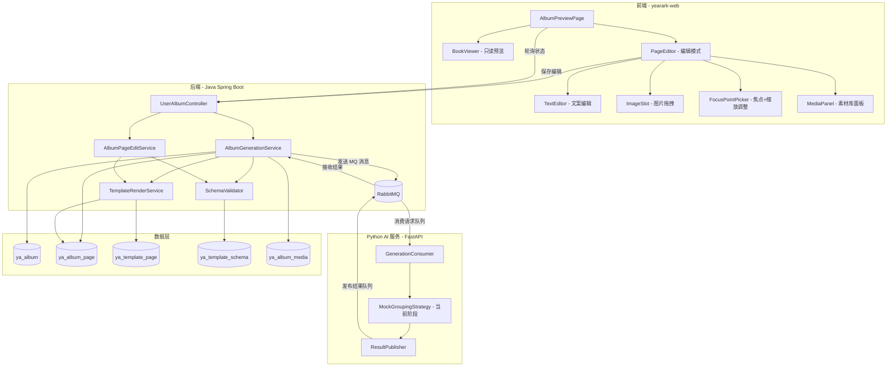
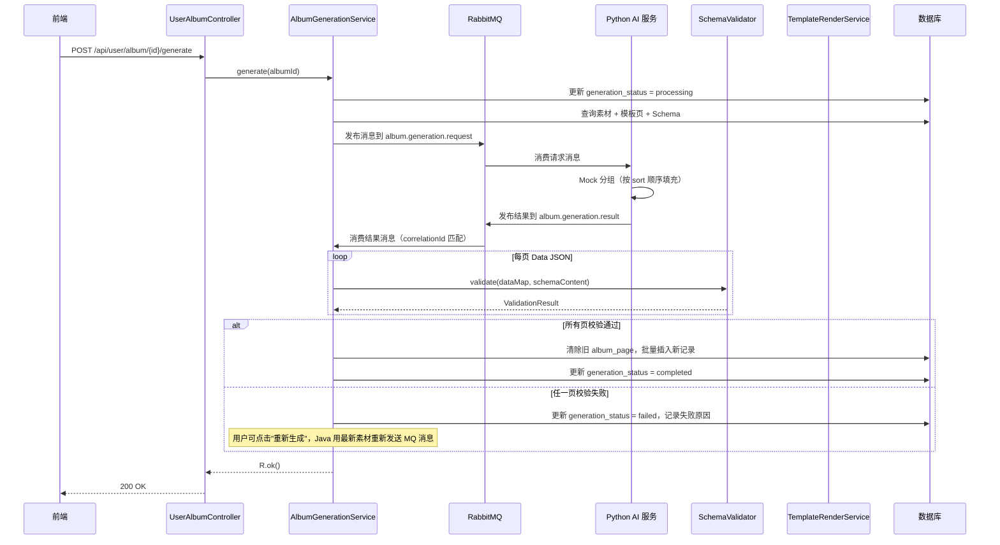
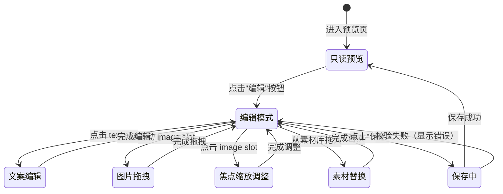
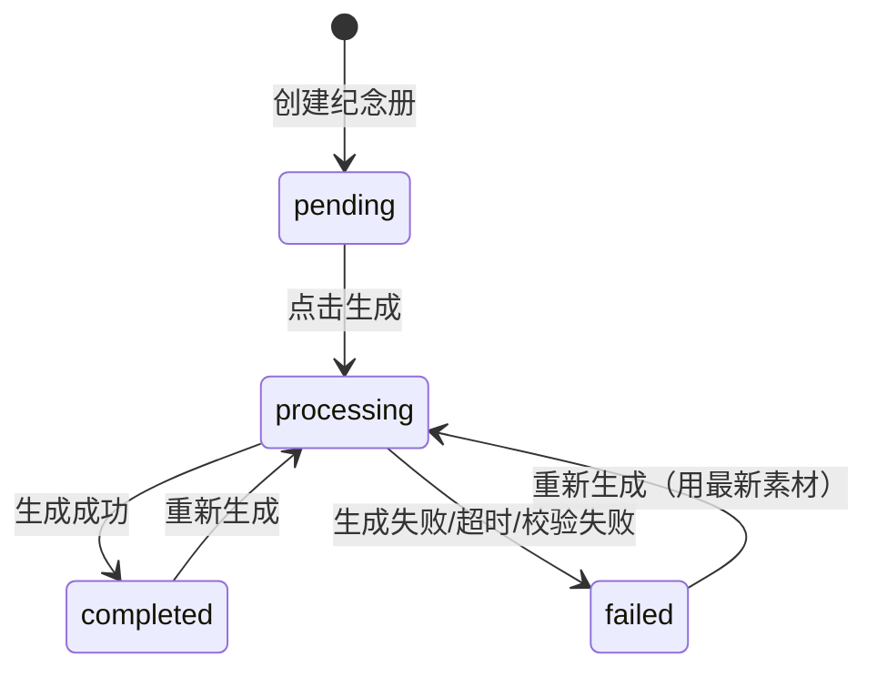

# 技术设计文档：纪念册渲染管线重构

## 概述

本设计文档描述纪念册渲染管线的完整重构方案，覆盖从素材数据收集、Python AI 服务智能分组、RabbitMQ 异步通信、Java 后端 Schema 校验与渲染、到前端可视化编辑的完整流程。

**核心目标：**
- Java 后端通过 RabbitMQ 将素材数据发送给 Python AI 服务
- Python AI 服务（当前阶段用 Mock 实现）完成素材分组、模板页匹配，输出每页的 Data JSON
- Java 后端接收 Data JSON 后进行 JSON Schema 校验，校验失败则整体重试（用最新素材重新发送）
- 重构模板渲染服务，支持 image slot 的 focus_point（裁剪焦点）和 scale（缩放）渲染
- 实现前端页面编辑器（拖拽编辑、文案修改、焦点调整、缩放调整）
- 新增生成状态管理（`generation_status` 字段）
- 提供编辑保存与重新渲染接口

**Python AI 服务当前阶段说明：**
Python FastAPI 服务的通信架构和接口契约完整实现，但内部分组算法暂用 Mock 实现（按 sort 顺序填充素材，focus_point 默认 `{0.5, 0.5}`，scale 默认 `1.0`）。后续替换真实 AI 算法时只需修改 Python 服务内部逻辑，Java 侧和通信协议无需变更。

---

## 架构

### 整体架构图



### 生成流程时序图



---

## RabbitMQ 通信协议

### Exchange 和 Queue 配置

| 名称 | 类型 | 说明 |
|------|------|------|
| `yearark.album` | Direct Exchange | 纪念册生成相关消息的 Exchange |
| `album.generation.request` | Queue | Java → Python 的生成请求队列 |
| `album.generation.result` | Queue | Python → Java 的生成结果队列 |

消息 TTL：5 分钟（超时后 Java 将状态更新为 `failed`）

### 请求消息结构（Java → Python）

```json
{
  "correlationId": "uuid-v4",
  "albumId": 123,
  "mediaList": [
    {
      "id": 1,
      "type": 2,
      "content": "https://oss.example.com/photo.jpg",
      "sort": 1
    },
    {
      "id": 2,
      "type": 1,
      "content": "这是一段文字",
      "sort": 1
    }
  ],
  "templatePages": [
    {
      "templatePageId": 10,
      "schemaId": 5,
      "imageCount": 2,
      "textCount": 1
    }
  ]
}
```

字段说明：
- `correlationId`：请求唯一标识，用于结果消息的请求-响应关联
- `mediaList[].type`：`2` = 图片，`1` = 文字
- `templatePages`：Java 从数据库查询后组装，Python 不需要访问数据库

### 结果消息结构（Python → Java）

```json
{
  "correlationId": "uuid-v4",
  "albumId": 123,
  "status": "success",
  "pages": [
    {
      "templatePageId": 10,
      "dataMap": {
        "image_1": {
          "url": "https://oss.example.com/photo.jpg",
          "focus_x": 0.5,
          "focus_y": 0.5,
          "scale": 1.0
        },
        "text_1": "这是一段文字"
      }
    }
  ],
  "errorMessage": null
}
```

字段说明：
- `status`：`success` 或 `failed`
- `pages[].dataMap`：image slot 值为对象格式（含 focus_x、focus_y、scale），text slot 值为字符串
- `errorMessage`：status 为 `failed` 时的错误描述

---

## Python AI 服务设计（FastAPI）

### 项目结构

```
yearark-ai/
├── main.py                    # FastAPI 应用入口
├── config.py                  # 配置（RabbitMQ 连接等）
├── consumer/
│   └── generation_consumer.py # 消费 album.generation.request 队列
├── publisher/
│   └── result_publisher.py    # 发布到 album.generation.result 队列
├── strategy/
│   ├── base.py                # GroupingStrategy 抽象基类
│   └── mock_strategy.py       # MockGroupingStrategy（当前阶段）
├── models/
│   ├── request.py             # GenerationRequest Pydantic 模型
│   └── result.py              # GenerationResult Pydantic 模型
└── requirements.txt
```

### MockGroupingStrategy 逻辑

当前阶段的 Mock 实现：
1. 将 `mediaList` 中 `type=2` 的图片按 `sort` 排序，`type=1` 的文字按 `sort` 排序
2. 遍历 `templatePages`，按顺序为每页分配素材：
   - 每页需要 `imageCount` 张图片和 `textCount` 条文字
   - 素材不足时跳过该页（不使用占位数据）
3. 每个 image slot 生成 `{url, focus_x: 0.5, focus_y: 0.5, scale: 1.0}`
4. 每个 text slot 直接使用素材文本内容

### FastAPI 健康检查接口

```
GET /health  →  {"status": "ok"}
```

---

## Java 后端组件设计

### 1. AlbumGenerationService（重构）

```java
public interface AlbumGenerationService {
    R<Void> generate(Integer albumId);
}
```

重构要点：
- 生成前校验：纪念册已关联模板且至少有 1 条 status=2 的素材
- 更新 `generation_status = processing`
- 组装 `GenerationRequestMessage`，发布到 RabbitMQ
- 监听结果队列，通过 `correlationId` 匹配响应
- 对每页 Data JSON 调用 `SchemaValidator` 校验
- 全部通过：清除旧 `ya_album_page`，批量插入新记录，更新状态为 `completed`
- 任一失败：更新状态为 `failed`，记录 `generation_fail_reason`
- 移除旧的 `DEFAULT_PLACEHOLDER_IMAGE` 占位图逻辑

### 2. SchemaValidator（新增）

```java
public interface SchemaValidator {
    ValidationResult validate(Map<String, Object> dataMap, String schemaContent);
}
```

校验规则：
1. 遍历 Schema 中的 `slots` 定义
2. `required=true` 的 slot 必须存在且值非空
3. `type=text` 的 slot 校验 `maxLength`（如有定义）
4. `type=image` 的 slot 校验 URL 格式合法性
5. 缺失的非必填 slot 使用 `default` 值填充（如有定义）

### 3. TemplateRenderService（重构）

扩展渲染逻辑，支持 image slot 的 focus_point 和 scale：

**渲染规则：**
- `{{image_N}}` 占位符替换为图片 URL
- 在对应 `` 标签注入 style：
  ```
  object-fit: cover;
  object-position: {focus_x*100}% {focus_y*100}%;
  transform: scale({scale});
  transform-origin: {focus_x*100}% {focus_y*100}%;
  ```
- 纯字符串 URL（向后兼容）：使用默认值 `focus_x=0.5, focus_y=0.5, scale=1.0`

### 4. AlbumPageEditService（新增）

```java
public interface AlbumPageEditService {
    RenderedPageVo updatePageData(Integer pageId, Map<String, Object> dataMap);
    List<RenderedPageVo> batchUpdatePageData(List<PageUpdateDto> updates);
}
```

- `updatePageData`：校验页面归属 → Schema 校验 → 更新 data → 重新渲染 → 返回 RenderedPageVo
- `batchUpdatePageData`：事务内批量校验和更新，任一页校验失败则整个操作回滚

---

## 数据模型

### 数据库变更

#### ya_album 表新增字段

```sql
ALTER TABLE ya_album
  ADD COLUMN generation_status VARCHAR(20) NOT NULL DEFAULT 'pending' COMMENT '生成状态：pending/processing/completed/failed',
  ADD COLUMN generation_fail_reason VARCHAR(500) DEFAULT NULL COMMENT '生成失败原因';
```

注：`is_degraded` 字段不需要，系统只有一种生成方式。

### Data JSON 格式

**image slot（对象格式）：**
```json
{
  "image_1": {
    "url": "https://oss.example.com/photo.jpg",
    "focus_x": 0.5,
    "focus_y": 0.3,
    "scale": 1.2
  },
  "text_1": "标题文字"
}
```

**向后兼容规则：**
- image slot 值为 `String` 时，视为 URL，`focus_x=0.5, focus_y=0.5, scale=1.0`
- image slot 值为 `Object` 时，解析 `url`、`focus_x`、`focus_y`、`scale` 字段
- text slot 值始终为 `String`

### JSON Schema 扩展格式

```json
{
  "slots": [
    {
      "id": "image_1",
      "type": "image",
      "label": "照片1",
      "required": true,
      "width": 800,
      "height": 600
    },
    {
      "id": "text_1",
      "type": "text",
      "label": "标题",
      "required": true,
      "maxLength": 20,
      "default": "默认标题"
    }
  ]
}
```

新增字段说明：

| 字段 | 适用类型 | 说明 |
|------|----------|------|
| width | image | 模板中图片框的设计宽度（像素），供 Python AI 参考图片尺寸匹配 |
| height | image | 模板中图片框的设计高度（像素） |
| maxLength | text | 文字最大长度 |
| default | text/image | 默认值，非必填 slot 缺失时自动填充 |

### ImageSlotValue 值对象

```java
@Data
public class ImageSlotValue {
    private String url;
    private Double focusX = 0.5;
    private Double focusY = 0.5;
    private Double scale = 1.0;

    public static ImageSlotValue fromDataValue(Object value) {
        if (value instanceof String url) {
            ImageSlotValue v = new ImageSlotValue();
            v.setUrl(url);
            return v;
        }
        if (value instanceof Map<?, ?> map) {
            ImageSlotValue v = new ImageSlotValue();
            v.setUrl(String.valueOf(map.get("url")));
            v.setFocusX(parseDouble(map.get("focus_x"), 0.5));
            v.setFocusY(parseDouble(map.get("focus_y"), 0.5));
            v.setScale(parseDouble(map.get("scale"), 1.0));
            return v;
        }
        return null;
    }

    private static Double parseDouble(Object val, double defaultVal) {
        if (val instanceof Number n) return n.doubleValue();
        return defaultVal;
    }
}
```

---

## API 接口设计

### 新增接口

| 方法 | 路径 | 说明 |
|------|------|------|
| POST | `/api/user/album/{id}/generate` | 触发生成（发送 MQ 消息） |
| GET | `/api/user/album/{id}/status` | 获取生成状态 |
| GET | `/api/user/album/{id}/edit-data` | 获取编辑数据（Data JSON + Schema） |
| PUT | `/api/user/album/page/{pageId}` | 更新单页 Data JSON |
| PUT | `/api/user/album/{id}/pages` | 批量更新多页 Data JSON |
| GET | `/api/user/album/{id}/unused-media` | 获取未使用的素材列表 |

### 接口详细定义

**GET `/api/user/album/{id}/status`**
```json
{
  "code": 200,
  "data": {
    "generationStatus": "completed",
    "failReason": null
  }
}
```

**GET `/api/user/album/{id}/edit-data`**
```json
{
  "code": 200,
  "data": {
    "pages": [
      {
        "pageId": 1,
        "sort": 1,
        "html": "<div>...</div>",
        "data": {
          "image_1": {"url": "https://...", "focus_x": 0.5, "focus_y": 0.5, "scale": 1.0},
          "text_1": "标题文字"
        },
        "schemaContent": "{\"slots\":[...]}"
      }
    ]
  }
}
```

**PUT `/api/user/album/page/{pageId}`**
```json
// Request
{
  "data": {
    "image_1": {"url": "https://...", "focus_x": 0.3, "focus_y": 0.4, "scale": 1.2},
    "text_1": "修改后的标题"
  }
}
// Response (成功)
{
  "code": 200,
  "data": {"pageId": 1, "sort": 1, "html": "<div>渲染后的HTML</div>"}
}
// Response (校验失败)
{
  "code": 500,
  "msg": "数据校验失败",
  "data": {
    "errors": [{"slotId": "text_1", "message": "文字长度超过最大限制20"}]
  }
}
```

---

## 前端组件设计

### PageEditor 核心组件

```typescript
interface PageEditorProps {
  albumId: number
  page: {
    pageId: number
    sort: number
    html: string
    data: Record<string, any>
    schemaContent: string
  }
  unusedMedia: AlbumMedia[]
}

interface ImageSlotValue {
  url: string
  focus_x: number
  focus_y: number
  scale: number
}
```

### FocusPointPicker 组件

- 点击 image slot 时显示焦点+缩放调整工具
- 拖动十字准星调整 `focus_x/focus_y`
- 滚轮或滑块调整 `scale`
- 实时预览：使用 `object-position` + `transform: scale()` 展示裁剪效果

### 编辑模式交互流程



---

## 错误处理

### 后端错误处理

| 场景 | 处理方式 |
|------|----------|
| 纪念册未关联模板 | 抛出 ServiceException("请先选择模板") |
| 无审核通过素材 | 抛出 ServiceException("请先上传素材") |
| MQ 消息超时（5分钟） | 更新 generation_status = failed，记录超时原因 |
| Python 返回 status=failed | 更新 generation_status = failed，记录 errorMessage |
| Schema 校验失败（生成时） | 更新 generation_status = failed，用户重新生成时用最新素材重发 |
| Schema 校验失败（编辑保存时） | 返回校验错误列表，不更新数据库 |
| 页面归属校验失败 | 抛出 ServiceException("无权操作") |
| 批量更新部分校验失败 | 整个批量操作回滚，返回所有错误 |

### generation_status 状态机



---

## 正确性属性（Correctness Properties）

### Property 1: Mock 生成的 Data JSON 所有 slot 均有真实素材填充

对于任意模板页列表和素材列表，Mock 策略生成的每页 Data JSON 中所有 required slot 必须有真实素材填充（非空、非占位数据）。素材不足时跳过无法完全填满的模板页。

### Property 2: Mock 生成的 image slot 默认值

Mock 策略生成的每个 image slot 的 `focus_x`、`focus_y` 等于 0.5，`scale` 等于 1.0。

### Property 3: Schema 校验器正确识别违规 slot

校验器应将所有 required 且值为空/缺失的 slot、超过 maxLength 的 text slot、非法 URL 的 image slot 标记为失败，返回结构化结果。

### Property 4: Schema 校验器 default 值自动填充

Schema 中定义了 `default` 值的非必填 slot，如果 Data JSON 中缺失，校验后应自动填充该默认值。

### Property 5: 生成前置条件校验

未关联模板或无 status=2 素材的纪念册，调用 generate 应抛出异常且 generation_status 不变。

### Property 6: 成功生成后状态与数据一致性

合法纪念册成功生成后：ya_album_page 记录数等于被选中的模板页数，generation_status 为 completed，每条记录的 data 字段非空且所有 required slot 有真实素材。

### Property 7: ImageSlotValue 解析兼容性

纯字符串 URL 解析后 focusX=0.5、focusY=0.5、scale=1.0；Map 格式解析后各字段值与原始值一致。

### Property 8: 渲染服务注入 focus_point 和 scale 样式

包含 image slot（带 focus_x、focus_y、scale）的 Data JSON 渲染后，对应 `` 标签应包含 `object-position` 和 `transform: scale()` 样式。

### Property 9: 图片拖拽交换数据对称性

两个 image slot A 和 B 执行拖拽交换后，A 的数据等于交换前 B 的数据，B 的数据等于交换前 A 的数据。

### Property 10: 单页更新 round-trip

校验通过的 Data JSON 提交后，重新查询该页面的 data 字段应等于提交的值。

### Property 11: 校验失败时数据不变

校验失败的更新请求，数据库中该页面的 data 字段保持更新前的值不变。

### Property 12: 页面归属校验

不属于当前用户的纪念册页面，更新请求应被拒绝。

### Property 13: 批量更新事务性

批量更新中任一页校验失败，所有页面的 data 字段都保持更新前的值不变。
