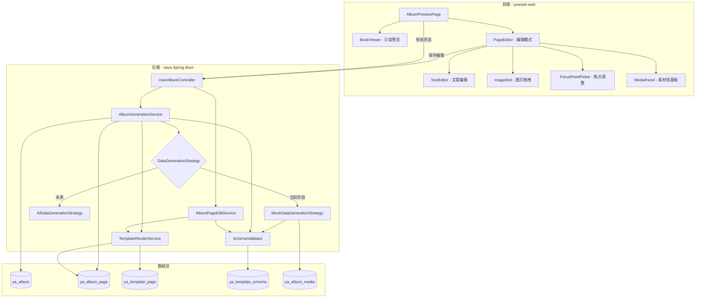
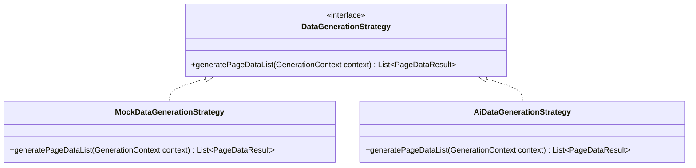
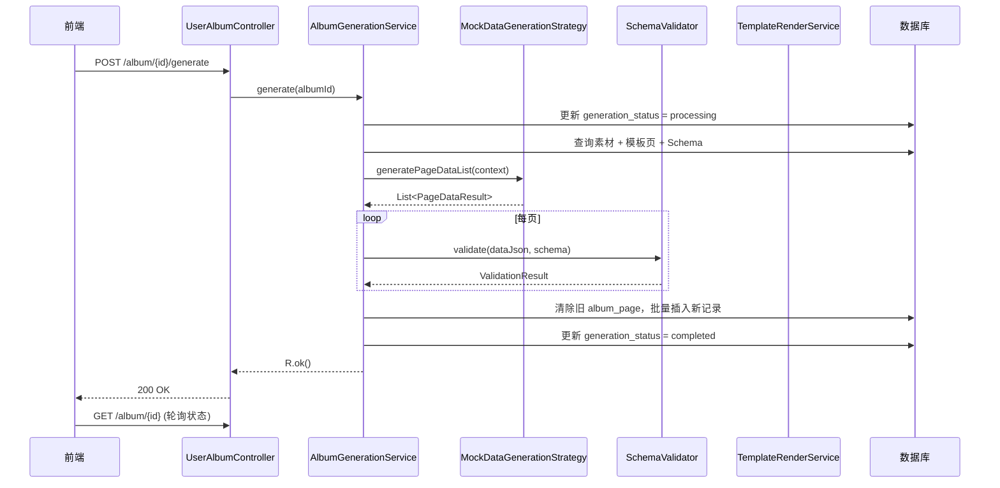
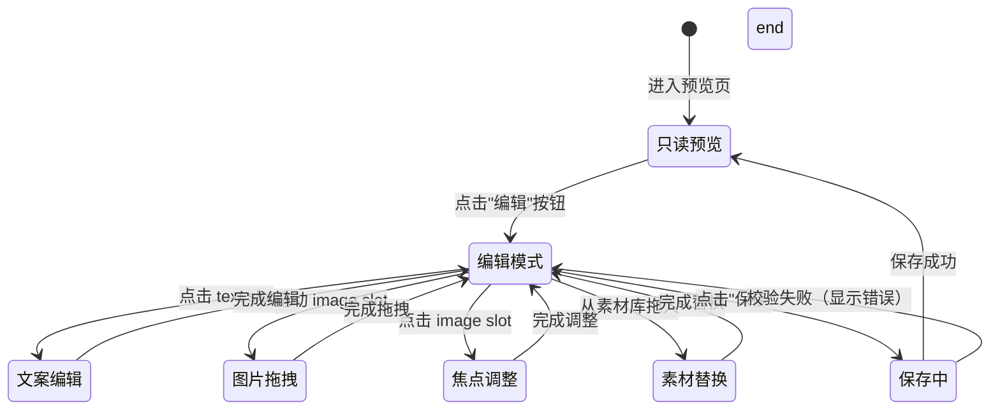
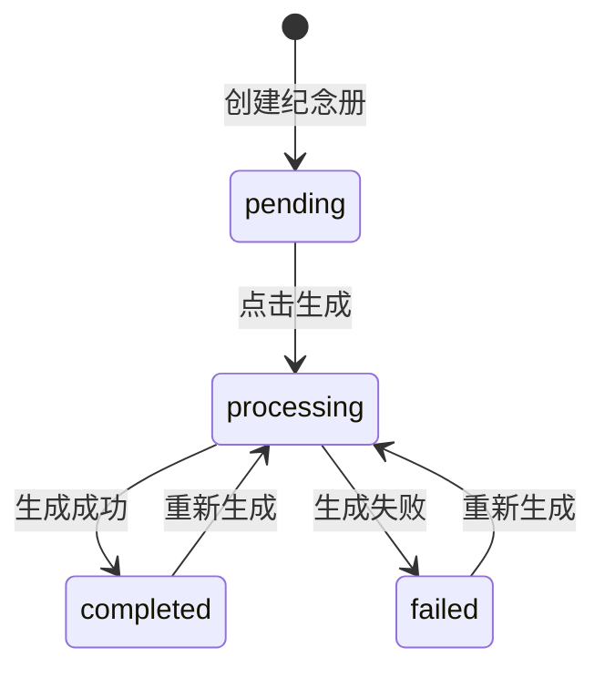

# 技术设计文档：纪念册渲染管线重构

## 概述

本设计文档描述纪念册渲染管线的重构方案，覆盖从素材数据收集到最终页面渲染、前端可视化编辑的完整流程。

**当前阶段核心目标：**
- 用 Mock 数据生成服务替代 AI 服务（按 sort 顺序填充素材，focus_point 默认 `{0.5, 0.5}`）
- 实现 JSON Schema 校验器，确保 Data JSON 结构正确
- 重构模板渲染服务，支持 image slot 的 focus_point 渲染（`object-fit: cover` + `object-position`）
- 实现前端页面编辑器（拖拽编辑、文案修改、焦点调整）
- 新增生成状态管理（`generation_status` 字段）
- 提供编辑保存与重新渲染接口

**Mock AI 策略说明：**
需求文档中的需求 1（RabbitMQ 通信）和需求 2（AI 分组策略）在当前阶段不实现。`Generation_Service` 内部通过 `MockDataGenerationStrategy` 直接生成 Data JSON，未来接入 AI 服务时只需实现 `DataGenerationStrategy` 接口的 AI 版本并切换即可。

## 架构

### 整体架构图



### 策略模式设计

数据生成采用策略模式，便于未来从 Mock 切换到 AI 服务：



### 生成流程时序图



## 组件与接口

### 1. DataGenerationStrategy（数据生成策略接口）

```java
public interface DataGenerationStrategy {
    /**
     * 根据素材和模板信息生成每页的 Data JSON
     */
    List<PageDataResult> generatePageDataList(GenerationContext context);
}
```

**GenerationContext（生成上下文）：**
```java
@Data
public class GenerationContext {
    private Integer albumId;
    private List<YaAlbumMedia> images;      // type=2, status=2, 按 sort 排序
    private List<YaAlbumMedia> texts;       // type=1, status=2, 按 sort 排序
    private List<TemplatePageInfo> pages;   // 模板页 + Schema 信息
}

@Data
public class TemplatePageInfo {
    private Integer templatePageId;
    private Integer schemaId;
    private Integer imageCount;
    private Integer textCount;
    private String schemaContent;           // JSON Schema 原始内容
}
```

**PageDataResult（单页生成结果）：**
```java
@Data
public class PageDataResult {
    private Integer templatePageId;
    private Map<String, Object> dataMap;    // slot_id -> value（支持 String 或 ImageSlotValue 对象）
}
```

### 2. MockDataGenerationStrategy（Mock 实现）

按 sort 顺序依次填充素材到模板页 slot：
- 图片 slot：生成 `ImageSlotValue` 对象，`focus_x=0.5, focus_y=0.5`
- 文字 slot：直接使用素材文本内容
- 素材不足时：先计算可用素材总量（图片数、文字数），然后从模板页列表中选择能被完全填满的页面子集（按 imageCount 升序优先选择需要素材较少的页面），跳过无法填满的页面，确保每个被选中页面的所有 required slot 都有真实素材填充，绝不使用占位图或空字符串

### 3. SchemaValidator（JSON Schema 校验器）

```java
public interface SchemaValidator {
    /**
     * 校验 Data JSON 是否符合 Schema 定义
     */
    ValidationResult validate(Map<String, Object> dataMap, String schemaContent);
}
```

**ValidationResult：**
```java
@Data
public class ValidationResult {
    private boolean valid;
    private List<SlotError> errors;
}

@Data
public class SlotError {
    private String slotId;
    private String message;
}
```

校验规则：
1. 遍历 Schema 中的 slots 定义
2. `required=true` 的 slot 必须存在且值非空
3. `type=text` 的 slot 校验 `maxLength`（如有定义）
4. `type=image` 的 slot 校验 URL 格式合法性
5. 缺失的非必填 slot 使用 `default` 值填充（如有定义）

### 4. AlbumGenerationService（重构）

在现有 `generate()` 方法基础上重构：
- 注入 `DataGenerationStrategy`（当前为 Mock 实现）
- 新增 `generation_status` 状态管理
- 集成 `SchemaValidator` 校验
- 校验失败的页面使用回退策略

```java
public interface AlbumGenerationService {
    R<Void> generate(Integer albumId);
}
```

### 5. TemplateRenderService（重构）

扩展渲染逻辑，支持 image slot 的 focus_point：
- Data JSON 中 image slot 值为对象时（`{url, focus_x, focus_y}`），渲染为带 `object-position` 的 `` 标签
- 值为纯字符串 URL 时，使用默认焦点 `{0.5, 0.5}`（向后兼容）

渲染规则：
```
{{image_1}} → 如果值是对象 {url, focus_x, focus_y}:
  替换为 url，并在对应  标签注入 style="object-fit:cover; object-position:{focus_x*100}% {focus_y*100}%"
```

### 6. AlbumPageEditService（新增）

```java
public interface AlbumPageEditService {
    /**
     * 更新单页 Data JSON（校验 + 存储 + 重新渲染）
     */
    RenderedPageVo updatePageData(Integer pageId, Map<String, Object> dataMap);

    /**
     * 批量更新多页 Data JSON（事务内完成）
     */
    List<RenderedPageVo> batchUpdatePageData(List<PageUpdateDto> updates);
}
```

**PageUpdateDto：**
```java
@Data
public class PageUpdateDto {
    @NotNull(message = "页面ID不能为空")
    private Integer pageId;

    @NotNull(message = "数据不能为空")
    private Map<String, Object> dataMap;
}
```

### 7. 前端组件设计

#### PageEditor（页面编辑器）

核心组件，负责将 Data JSON 解析为可编辑元素：

```typescript
interface PageEditorProps {
  albumId: number
  page: {
    pageId: number
    sort: number
    html: string
    data: Record<string, any>       // Data JSON
    schema: SchemaSlot[]            // Schema slots 定义
  }
  unusedMedia: AlbumMedia[]         // 未使用的素材
}

interface SchemaSlot {
  id: string
  type: 'image' | 'text'
  label: string
  required: boolean
  maxLength?: number
}

interface ImageSlotValue {
  url: string
  focus_x: number
  focus_y: number
}
```

#### 编辑模式交互流程



### 8. API 接口设计

#### 新增接口

| 方法 | 路径 | 说明 |
|------|------|------|
| GET | `/api/user/album/{id}/status` | 获取生成状态 |
| GET | `/api/user/album/{id}/edit-data` | 获取编辑数据（Data JSON + Schema） |
| PUT | `/api/user/album/page/{pageId}` | 更新单页 Data JSON |
| PUT | `/api/user/album/{id}/pages` | 批量更新多页 Data JSON |
| GET | `/api/user/album/{id}/unused-media` | 获取未使用的素材列表 |

#### 接口详细定义

**GET `/api/user/album/{id}/status`**
```json
// Response
{
  "code": 200,
  "data": {
    "generationStatus": "completed",  // pending | processing | completed | failed
    "failReason": null
  }
}
```

**GET `/api/user/album/{id}/edit-data`**
```json
// Response
{
  "code": 200,
  "data": {
    "pages": [
      {
        "pageId": 1,
        "sort": 1,
        "html": "<div>...</div>",
        "data": {
          "image_1": {"url": "https://...", "focus_x": 0.5, "focus_y": 0.5},
          "text_1": "标题文字"
        },
        "schema": {
          "slots": [
            {"id": "image_1", "type": "image", "label": "照片1", "required": true},
            {"id": "text_1", "type": "text", "label": "标题", "required": true, "maxLength": 20}
          ]
        }
      }
    ]
  }
}
```

**PUT `/api/user/album/page/{pageId}`**
```json
// Request
{
  "data": {
    "image_1": {"url": "https://...", "focus_x": 0.3, "focus_y": 0.4},
    "text_1": "修改后的标题"
  }
}
// Response (成功)
{
  "code": 200,
  "data": {
    "pageId": 1,
    "sort": 1,
    "html": "<div>渲染后的HTML</div>"
  }
}
// Response (校验失败)
{
  "code": 500,
  "msg": "数据校验失败",
  "data": {
    "errors": [
      {"slotId": "text_1", "message": "文字长度超过最大限制20"}
    ]
  }
}
```

**PUT `/api/user/album/{id}/pages`**
```json
// Request
{
  "pages": [
    {"pageId": 1, "data": {"image_1": {...}, "text_1": "..."}},
    {"pageId": 2, "data": {"image_1": {...}, "text_1": "..."}}
  ]
}
```


## 数据模型

### 数据库变更

#### ya_album 表新增字段

| 字段 | 类型 | 默认值 | 说明 |
|------|------|--------|------|
| generation_status | VARCHAR(20) | 'pending' | 生成状态：pending / processing / completed / failed |
| generation_fail_reason | VARCHAR(500) | NULL | 生成失败原因 |
| is_degraded | TINYINT(1) | 0 | 是否使用了降级方案生成 |

```sql
ALTER TABLE ya_album
  ADD COLUMN generation_status VARCHAR(20) NOT NULL DEFAULT 'pending' COMMENT '生成状态',
  ADD COLUMN generation_fail_reason VARCHAR(500) DEFAULT NULL COMMENT '生成失败原因',
  ADD COLUMN is_degraded TINYINT(1) NOT NULL DEFAULT 0 COMMENT '是否降级方案';
```

#### YaAlbum 实体新增字段

```java
/** 生成状态：pending / processing / completed / failed */
private String generationStatus;

/** 生成失败原因 */
private String generationFailReason;

/** 是否使用降级方案（0 否 1 是） */
private Integer isDegraded;
```

### Data JSON 格式扩展

**现有格式（纯字符串值）：**
```json
{
  "image_1": "https://oss.example.com/photo.jpg",
  "text_1": "标题文字"
}
```

**扩展后格式（image slot 支持对象值）：**
```json
{
  "image_1": {
    "url": "https://oss.example.com/photo.jpg",
    "focus_x": 0.5,
    "focus_y": 0.3
  },
  "text_1": "标题文字"
}
```

**向后兼容规则：**
- image slot 值为 `String` 时，视为 URL，focus_point 默认 `{0.5, 0.5}`
- image slot 值为 `Object` 时，解析 `url`、`focus_x`、`focus_y` 字段
- text slot 值始终为 `String`

### ImageSlotValue 值对象

```java
@Data
public class ImageSlotValue {
    /** 图片 URL */
    @NotBlank(message = "图片URL不能为空")
    private String url;

    /** 焦点 X 坐标（0.0~1.0） */
    private Double focusX = 0.5;

    /** 焦点 Y 坐标（0.0~1.0） */
    private Double focusY = 0.5;

    /**
     * 从 Data JSON 中的值解析 ImageSlotValue
     * 兼容纯字符串 URL 和对象格式
     */
    public static ImageSlotValue fromDataValue(Object value) {
        if (value instanceof String url) {
            ImageSlotValue v = new ImageSlotValue();
            v.setUrl(url);
            return v;
        }
        // Map 格式解析
        if (value instanceof Map<?, ?> map) {
            ImageSlotValue v = new ImageSlotValue();
            v.setUrl(String.valueOf(map.get("url")));
            v.setFocusX(parseDouble(map.get("focus_x"), 0.5));
            v.setFocusY(parseDouble(map.get("focus_y"), 0.5));
            return v;
        }
        return null;
    }

    private static Double parseDouble(Object val, double defaultVal) {
        if (val instanceof Number n) return n.doubleValue();
        return defaultVal;
    }
}
```

### JSON Schema 扩展格式

在现有 slot 定义基础上新增校验规则字段：

```json
{
  "slots": [
    {
      "id": "image_1",
      "type": "image",
      "label": "照片1",
      "required": true,
      "imageMinWidth": 800,
      "imageMinHeight": 600,
      "imageAspectRatio": "16:9"
    },
    {
      "id": "text_1",
      "type": "text",
      "label": "标题",
      "required": true,
      "maxLength": 20,
      "minLength": 1,
      "pattern": null,
      "default": "默认标题"
    }
  ]
}
```

| 新增字段 | 适用类型 | 说明 |
|----------|----------|------|
| maxLength | text | 文字最大长度 |
| minLength | text | 文字最小长度 |
| pattern | text | 正则匹配（如日期格式） |
| default | text/image | 默认值，非必填 slot 缺失时自动填充 |
| imageMinWidth | image | 图片最小宽度（像素），仅警告 |
| imageMinHeight | image | 图片最小高度（像素），仅警告 |
| imageAspectRatio | image | 推荐宽高比（如 "16:9"），仅警告 |

### RenderedPageVo 扩展

```java
@Data
public class RenderedPageVo {
    private Integer pageId;
    private Integer sort;
    private String html;
}
```

### EditablePageVo（新增，编辑模式用）

```java
@Data
public class EditablePageVo {
    private Integer pageId;
    private Integer sort;
    private String html;
    private Map<String, Object> data;       // Data JSON
    private String schemaContent;           // Schema JSON 字符串
}
```


## 正确性属性（Correctness Properties）

*属性（Property）是指在系统所有合法执行路径中都应成立的特征或行为——本质上是对系统应做什么的形式化陈述。属性是人类可读规格说明与机器可验证正确性保证之间的桥梁。*

### Property 1: Mock 生成的 Data JSON 所有 slot 均有真实素材填充

*对于任意* 模板页列表和素材列表，Mock 策略生成的每页 Data JSON 中：(a) key 集合应该与该页 Schema 定义的 slot id 集合完全一致；(b) 每个 required image slot 的值必须是真实的素材 URL（非空、非占位图）；(c) 每个 required text slot 的值必须是真实的素材文本（非空字符串）。如果素材不足，Mock 策略应跳过无法完全填满的模板页，而非使用占位数据。

**Validates: Requirements 2.4, 4.4**

### Property 2: Mock 生成的 image slot 焦点默认值

*对于任意* Mock 策略生成的 Data JSON，其中每个 image 类型 slot 的 `focus_x` 和 `focus_y` 值都应该等于 0.5。

**Validates: Requirements 2.5, 5.1**

### Property 3: Schema 校验器正确识别违规 slot

*对于任意* JSON Schema 和 Data JSON 组合，校验器应该：(a) 将所有 required 且值为空/缺失的 slot 标记为失败；(b) 将所有超过 maxLength 的 text slot 标记为失败；(c) 将所有非法 URL 格式的 image slot 标记为失败；(d) 返回包含 `valid` 布尔值和 `errors` 列表的结构化结果。

**Validates: Requirements 3.2, 3.3, 3.4, 3.5, 3.6**

### Property 4: Schema 校验器 default 值自动填充

*对于任意* JSON Schema 中定义了 `default` 值的非必填 slot，如果 Data JSON 中缺失该 slot，校验后的 Data JSON 应该包含该 slot 且值等于 Schema 中定义的 `default` 值。

**Validates: Requirements 3.7**

### Property 5: 生成前置条件校验

*对于任意* 纪念册，如果未关联模板或没有 status=2 的素材，调用 generate 应该抛出异常且 generation_status 不变。

**Validates: Requirements 4.1**

### Property 6: 成功生成后状态与数据一致性

*对于任意* 合法的纪念册（已关联模板且有审核通过素材），成功生成后：(a) ya_album_page 记录数量等于被选中的模板页数量（素材不足时可能少于模板页总数）；(b) generation_status 为 "completed"；(c) 每条 album_page 的 data 字段非空且所有 required slot 都有真实素材填充。

**Validates: Requirements 2.4, 4.4, 4.7**

### Property 7: ImageSlotValue 解析兼容性

*对于任意* 合法的图片 URL 字符串，`ImageSlotValue.fromDataValue(url)` 解析后的 `url` 等于原始字符串，`focusX` 和 `focusY` 等于 0.5。*对于任意* 包含 `url`、`focus_x`、`focus_y` 的 Map 对象，解析后各字段值与原始值一致。

**Validates: Requirements 5.2, 5.5**

### Property 8: 渲染服务注入 focus_point 样式

*对于任意* 包含 image slot（带 focus_x 和 focus_y）的 Data JSON 和 HTML 模板，渲染后的 HTML 中对应的 `` 标签应该包含 `object-position` 样式，且百分比值与 focus_x、focus_y 对应。

**Validates: Requirements 5.3**

### Property 9: 图片拖拽交换数据对称性

*对于任意* 两个 image slot A 和 B，执行拖拽交换后，A 的数据应该等于交换前 B 的数据，B 的数据应该等于交换前 A 的数据。

**Validates: Requirements 6.4**

### Property 10: 单页更新 round-trip

*对于任意* 校验通过的 Data JSON，通过更新接口提交后，重新查询该页面的 data 字段应该等于提交的值，且返回的 HTML 中包含 Data JSON 中的实际内容值。

**Validates: Requirements 8.1, 8.2**

### Property 11: 校验失败时数据不变

*对于任意* 校验失败的 Data JSON 更新请求，数据库中该页面的 data 字段应该保持更新前的值不变。

**Validates: Requirements 8.3**

### Property 12: 页面归属校验

*对于任意* 用户和不属于该用户的纪念册页面，更新请求应该被拒绝。

**Validates: Requirements 8.4**

### Property 13: 批量更新事务性

*对于任意* 批量更新请求，如果其中任一页的 Data JSON 校验失败，则所有页面的 data 字段都应该保持更新前的值不变。

**Validates: Requirements 8.5**


## 错误处理

### 后端错误处理

| 场景 | 处理方式 | HTTP 状态码 |
|------|----------|-------------|
| 纪念册不存在 | 抛出 ServiceException | 500 |
| 未关联模板 | 抛出 ServiceException("请先选择模板") | 500 |
| 无审核通过素材 | 抛出 ServiceException("请先上传素材") | 500 |
| 模板页 Schema 不存在 | 跳过该页，记录 warn 日志 | — |
| Data JSON 序列化失败 | 抛出 ServiceException，回滚事务 | 500 |
| Schema 校验失败（生成时） | 该页使用回退策略（顺序填充），记录日志 | — |
| Schema 校验失败（编辑保存时） | 返回校验错误列表，不更新数据库 | 200（业务错误码） |
| 页面归属校验失败 | 抛出 ServiceException("无权操作") | 500 |
| 批量更新部分校验失败 | 整个批量操作回滚，返回所有错误 | 200（业务错误码） |
| Data JSON 解析失败（渲染时） | 清除所有占位符返回，记录 warn 日志 | — |

### 前端错误处理

| 场景 | 处理方式 |
|------|----------|
| 生成请求失败 | Toast 提示错误信息 |
| 轮询超时（超过 5 分钟无响应） | 停止轮询，提示"请刷新页面查看状态" |
| 编辑保存校验失败 | 在对应 slot 显示红色边框 + 错误提示 |
| 编辑保存网络失败 | Toast 提示"保存失败，请重试" |
| 预览数据加载失败 | 显示空状态 + 返回按钮 |

### generation_status 状态机



**状态流转规则：**
- 只有 `pending`、`completed`、`failed` 状态可以触发生成
- `processing` 状态下不允许重复触发生成
- 生成开始时立即更新为 `processing`
- 生成成功更新为 `completed`，失败更新为 `failed` 并记录 `generation_fail_reason`

## 测试策略

### 测试方法

采用**单元测试 + 属性测试**双轨策略：

- **单元测试**：验证具体示例、边界情况和错误条件
- **属性测试**：验证跨所有输入的通用属性

两者互补，单元测试捕获具体 bug，属性测试验证通用正确性。

### 属性测试配置

- **后端**：使用 **jqwik**（Java 属性测试库）
- **前端**：使用 **fast-check**（TypeScript 属性测试库）
- 每个属性测试最少运行 **100 次迭代**
- 每个属性测试必须用注释标注对应的设计文档属性
- 标注格式：`Feature: album-render-pipeline, Property {number}: {property_text}`
- 每个正确性属性由**单个**属性测试实现

### 后端测试计划

#### 属性测试

| 属性 | 测试类 | 说明 |
|------|--------|------|
| Property 1 | MockDataGenerationStrategyPropertyTest | 生成随机素材列表和 Schema，验证 Data JSON key 集合一致 |
| Property 2 | MockDataGenerationStrategyPropertyTest | 验证所有 image slot 的 focus_point 为 {0.5, 0.5} |
| Property 3 | SchemaValidatorPropertyTest | 生成随机 Schema 和违规 Data JSON，验证校验结果 |
| Property 4 | SchemaValidatorPropertyTest | 生成含 default 的 Schema 和缺失 slot 的 Data JSON，验证填充 |
| Property 5 | AlbumGenerationServicePropertyTest | 生成无模板/无素材的纪念册，验证异常抛出 |
| Property 6 | AlbumGenerationServicePropertyTest | 生成合法纪念册，验证 album_page 数量和状态 |
| Property 7 | ImageSlotValuePropertyTest | 生成随机 URL 和 Map，验证解析兼容性 |
| Property 8 | TemplateRenderServicePropertyTest | 生成含 focus_point 的 Data JSON，验证渲染 HTML 包含 object-position |
| Property 10 | AlbumPageEditServicePropertyTest | 生成合法 Data JSON，验证更新 round-trip |
| Property 11 | AlbumPageEditServicePropertyTest | 生成违规 Data JSON，验证数据不变 |
| Property 12 | AlbumPageEditServicePropertyTest | 模拟非归属用户，验证拒绝 |
| Property 13 | AlbumPageEditServicePropertyTest | 生成含违规页的批量请求，验证全部回滚 |

#### 单元测试

| 测试类 | 覆盖场景 |
|--------|----------|
| SchemaValidatorTest | 具体的校验成功/失败示例、空 Schema、空 Data JSON |
| MockDataGenerationStrategyTest | 素材不足时的智能页面选择（跳过无法填满的页面）、素材超出时的截断 |
| TemplateRenderServiceTest | 向后兼容（纯字符串 URL 渲染）、空模板、空数据 |
| AlbumGenerationServiceTest | 完整生成流程集成测试、状态流转验证 |

### 前端测试计划

#### 属性测试

| 属性 | 测试文件 | 说明 |
|------|----------|------|
| Property 9 | PageEditor.property.test.ts | 生成随机 image slot 对，验证拖拽交换对称性 |

#### 单元测试

| 测试文件 | 覆盖场景 |
|----------|----------|
| PageEditor.test.ts | 编辑模式切换、文案编辑、保存流程 |
| BookViewer.test.ts | 翻页导航、页面渲染 |
| FocusPointPicker.test.ts | 焦点坐标拖动、边界值 |

