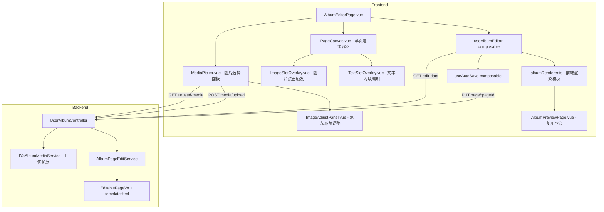

# Design Document: Album Visual Editor

## Overview

纪念册可视化编辑器（Album Visual Editor）是一个独立的前端编辑页面（路由 `/album/:id/edit`），允许纪念册创建者对已生成的纪念册内容进行可视化编辑。

核心改造点：
- 将渲染逻辑从后端迁移到前端，前端统一维护 `{{slot_id}}` 占位符替换逻辑
- 新增独立编辑路由页面 `AlbumEditorPage.vue`
- 支持文案内联编辑（contenteditable）和图片可视化调整（焦点拖拽 + 缩放）
- 通过 AutoSave 机制在编辑完成后自动持久化
- 后端扩展 `EditablePageVo` 返回 `templateHtml` 字段，新增登录用户图片上传接口

## Architecture



关键设计决策：
- `albumRenderer.ts` 作为纯函数模块，被 Editor 和 PreviewPage 共同 import
- 编辑交互通过 Overlay 层叠加在渲染好的 HTML 上，不修改模板 HTML 本身
- AutoSave 在 blur/Enter/确认时触发，不维护 undo/redo

## Components and Interfaces

### 1. albumRenderer.ts — 前端渲染纯函数模块

路径：`yearark-web/src/utils/albumRenderer.ts`

该模块为纯函数，无副作用，被 `AlbumEditorPage` 和 `AlbumPreviewPage` 共同 import。

```typescript
/**
 * 将 templateHtml 中的 {{slot_id}} 占位符替换为 dataJson 中的值
 * - text slot (string)：HTML 转义后替换
 * - image slot (ImageSlotValue)：生成带 focus/scale 样式的  标签
 * - 未定义的占位符：替换为空字符串
 */
export function renderPage(
  templateHtml: string,
  data: Record<string, string | ImageSlotValue>
): string
```

渲染逻辑与后端 `TemplateRenderServiceImpl` 保持一致：
- text slot：`{{text_N}}` → HTML 转义文本
- image slot：`{{image_N}}` → 替换 URL 并注入 `object-fit:cover; object-position; transform:scale; transform-origin` 样式
- 剩余未匹配占位符 → 空字符串

### 2. AlbumEditorPage.vue — 编辑器主页面

路径：`yearark-web/src/views/AlbumEditorPage.vue`
路由：`/album/:id/edit`（需登录鉴权）

职责：
- 调用 `useAlbumEditor` 加载编辑数据
- 顶部导航栏：返回按钮（→ `/album/:id`）+ 纪念册名称
- 竖向滚动排列所有 `PageCanvas` 组件
- 管理 MediaPicker / ImageAdjustPanel 的弹出状态
- 展示加载中 / 空状态

### 3. PageCanvas.vue — 单页渲染容器

Props：`pageData: PageData`，`activeSlotId: string | null`

职责：
- 调用 `renderPage(templateHtml, data)` 生成 HTML，通过 `v-html` 渲染
- 解析 `schemaContent` 中的 slots 定义，在渲染 HTML 上叠加 Overlay 层
- text slot → `TextSlotOverlay`
- image slot → `ImageSlotOverlay`
- Overlay 通过绝对定位覆盖在对应 DOM 元素上方

### 4. TextSlotOverlay.vue — 文本内联编辑

Props：`slotId: string`，`value: string`，`position: DOMRect`

Events：`update:value(slotId, newText)`

职责：
- 点击进入 `contenteditable` 编辑模式，展示高亮边框
- blur 或 Enter 退出编辑，emit `update:value` 触发 AutoSave
- 不支持富文本，仅纯文本

### 5. ImageSlotOverlay.vue — 图片点击触发

Props：`slotId: string`，`value: ImageSlotValue`，`position: DOMRect`

Events：`select(slotId)`

职责：
- 点击时 emit `select` 事件，由 AlbumEditorPage 打开 MediaPicker
- 展示半透明遮罩 + 相机图标提示可替换

### 6. MediaPicker.vue — 图片选择面板

Props：`albumId: number`，`visible: boolean`

Events：`pick(media: YaAlbumMediaVo)`，`close`

职责：
- 调用 `GET /api/user/album/{id}/unused-media` 加载素材列表（type=2, status=2）
- 网格展示缩略图
- 支持面板内上传：调用 `POST /api/user/album/{id}/media/upload`
- 上传成功后将新素材追加到列表头部
- 选择图片后 emit `pick`，关闭面板

### 7. ImageAdjustPanel.vue — 焦点拖拽 + 缩放调整

Props：`imageUrl: string`，`initialValue: ImageSlotValue`

Events：`confirm(value: ImageSlotValue)`，`cancel`

职责：
- 图片预览区域：拖拽调整 focus_x / focus_y（范围 0.0 ~ 1.0）
- 缩放滑块：调整 scale（范围 0.5 ~ 3.0）
- 不提供旋转功能
- 确认 → emit `confirm`（触发 AutoSave）
- 取消 → emit `cancel`（恢复原始值，不触发 AutoSave）

### 8. useAlbumEditor composable

路径：`yearark-web/src/composables/useAlbumEditor.ts`

```typescript
export function useAlbumEditor(albumId: Ref<number>) {
  const pages: Ref<PageData[]>       // 所有页面数据
  const loading: Ref<boolean>
  const albumName: Ref<string>

  function loadEditData(): Promise<void>
  function updateSlotValue(pageId: number, slotId: string, value: string | ImageSlotValue): void
  function getPageData(pageId: number): PageData | undefined

  return { pages, loading, albumName, loadEditData, updateSlotValue, getPageData }
}
```

`updateSlotValue` 更新本地 `pages` 中对应 slot 的值，并触发 `useAutoSave`。

### 9. useAutoSave composable

路径：`yearark-web/src/composables/useAutoSave.ts`

```typescript
export function useAutoSave() {
  const saving: Ref<boolean>

  async function save(pageId: number, data: Record<string, unknown>): Promise<RenderedPageVo>

  return { saving, save }
}
```

调用 `PUT /api/user/album/page/{pageId}` 保存整页 DataJson。
保存中展示 loading 状态，成功后展示 toast，失败展示错误提示并保留用户输入。

### 10. 后端变更

#### 10.1 EditablePageVo 新增 templateHtml 字段

```java
@Data
public class EditablePageVo {
    // ... 现有字段保留
    /** 模板原始 HTML（含 {{slot_id}} 占位符） */
    private String templateHtml;
}
```

在 `AlbumPageEditServiceImpl.getEditData()` 中填充 `vo.setTemplateHtml(tp.getContent())`。

#### 10.2 新增上传接口

`POST /api/user/album/{id}/media/upload`

在 `UserAlbumController` 新增端点，接收 `MultipartFile`：
- 验证用户对纪念册的所有权（`albumService.checkOwnership`）
- 验证文件 MIME 类型为 `image/*`
- 上传文件到 OSS，获取 URL
- 插入 `ya_album_media` 记录：`type=2, status=2, tokenId=null`
- 使用 MyBatis Plus Service 层方法（`albumMediaService.save()`），不使用 Mapper
- 返回 `YaAlbumMediaVo`

#### 10.3 unused-media 接口查询条件调整

将 `listUnusedImages` 方法改为查询该纪念册所有 `type=2, status=2` 的图片，
移除"未使用"过滤逻辑，按 `sort` 升序返回。接口路径和返回结构不变。


## Data Models

### 前端 TypeScript 类型

```typescript
/** 图片 slot 值 */
export interface ImageSlotValue {
  url: string
  focus_x: number  // 0.0 ~ 1.0，默认 0.5
  focus_y: number  // 0.0 ~ 1.0，默认 0.5
  scale: number    // 0.5 ~ 3.0，默认 1.0
}

/** 文本 slot 值 = string */
export type TextSlotValue = string

/** slot 值联合类型 */
export type SlotValue = TextSlotValue | ImageSlotValue

/** Schema 中的 slot 定义 */
export interface SlotDef {
  id: string          // e.g. "image_1", "text_1"
  type: 'image' | 'text'
  label: string
  required: boolean
  maxLength?: number  // text only
  width?: number      // image only
  height?: number     // image only
  default?: string
}

/** 单页编辑数据（对应后端 EditablePageVo） */
export interface PageData {
  pageId: number
  sort: number
  html: string                              // 后端渲染的 HTML（向后兼容）
  templateHtml: string                      // 模板原始 HTML（含占位符）
  data: Record<string, SlotValue>           // DataJson
  schemaContent: string                     // Schema JSON 字符串
}
```

### 后端 VO 变更

`EditablePageVo` 新增一个字段：

| 字段 | 类型 | 说明 |
|------|------|------|
| `templateHtml` | `String` | 模板页原始 HTML（`YaTemplatePage.content`），含 `{{slot_id}}` 占位符 |

其余字段（`pageId`, `sort`, `html`, `data`, `schemaContent`）保持不变。

上传接口无新增实体，复用现有 `YaAlbumMedia` 实体和 `YaAlbumMediaVo`。
参数校验在 Service 层完成（文件 MIME 类型校验、所有权校验）。


## Correctness Properties

*A property is a characteristic or behavior that should hold true across all valid executions of a system — essentially, a formal statement about what the system should do. Properties serve as the bridge between human-readable specifications and machine-verifiable correctness guarantees.*

### Property 1: Renderer eliminates all placeholders

*For any* templateHtml string containing `{{slot_id}}` placeholders and *for any* DataJson map, after calling `renderPage(templateHtml, data)`, the output string SHALL contain zero occurrences of the `{{...}}` pattern. Matched slots are replaced with their values; unmatched slots become empty strings.

**Validates: Requirements 1.1, 1.4**

### Property 2: Text slot values are HTML-escaped

*For any* text slot value containing HTML special characters (`<`, `>`, `&`, `"`, `'`), the rendered output SHALL contain the escaped equivalents (`&lt;`, `&gt;`, `&amp;`, `&quot;`, `&#x27;`) and SHALL NOT contain the raw unescaped characters within the replaced region.

**Validates: Requirements 1.2**

### Property 3: Image slot renders with correct styles

*For any* ImageSlotValue with url, focus_x, focus_y, and scale, the rendered output SHALL contain an `` tag whose `src` equals the url and whose inline style includes `object-position` derived from focus_x/focus_y and `transform: scale()` derived from scale.

**Validates: Requirements 1.3**

### Property 4: templateHtml equals template page content

*For any* album page returned by `getEditData()`, the `templateHtml` field SHALL equal the `content` field of the corresponding `YaTemplatePage` record.

**Validates: Requirements 2.2**

### Property 5: Text edit completion triggers auto-save with full DataJson

*For any* text slot edit followed by a completion event (blur or Enter), the system SHALL invoke `PUT /api/user/album/page/{pageId}` with the complete page DataJson including the updated text value.

**Validates: Requirements 4.2, 4.3, 7.1**

### Property 6: Image adjust confirm triggers auto-save

*For any* image slot adjustment that is confirmed, the system SHALL invoke `PUT /api/user/album/page/{pageId}` with the complete page DataJson containing the new ImageSlotValue (url, focus_x, focus_y, scale).

**Validates: Requirements 6.4, 7.2**

### Property 7: Image adjust cancel restores original value

*For any* image slot adjustment that is cancelled, the slot value SHALL equal the original ImageSlotValue that existed before the adjustment began, and no save request SHALL be made.

**Validates: Requirements 6.5**

### Property 8: ImageSlotValue constraints are clamped

*For any* user interaction that modifies focus_x, focus_y, or scale, the resulting ImageSlotValue SHALL satisfy: `0.0 <= focus_x <= 1.0`, `0.0 <= focus_y <= 1.0`, and `0.5 <= scale <= 3.0`. Values outside these ranges SHALL be clamped to the nearest boundary.

**Validates: Requirements 6.1, 6.2**

### Property 9: Auto-save failure preserves user input

*For any* auto-save request that fails (network error or server error), the local page DataJson SHALL remain unchanged with the user's edited values intact, and no data SHALL be reverted.

**Validates: Requirements 4.5**

### Property 10: Upload creates media with correct invariants

*For any* successful image upload by a logged-in user, the created `ya_album_media` record SHALL have `type=2`, `status=2`, and `tokenId=null`. The record's `albumId` SHALL match the target album.

**Validates: Requirements 8.3**

### Property 11: Upload validates ownership and MIME type

*For any* upload request, if the user does not own the album OR the file MIME type is not `image/*`, the system SHALL reject the request with an error and SHALL NOT create any media record.

**Validates: Requirements 8.2, 8.4**

### Property 12: Media list returns all approved images in sort order

*For any* album, the media list endpoint SHALL return exactly those `ya_album_media` records where `type=2` AND `status=2`, ordered by `sort` ascending. No other filtering (e.g., "unused") SHALL be applied.

**Validates: Requirements 9.1, 9.2**


## Error Handling

### 前端错误处理

| 场景 | 处理方式 |
|------|----------|
| edit-data 加载失败 | 展示错误提示，提供重试按钮 |
| AutoSave 请求失败 | toast 展示错误信息，保留用户输入不丢失，不自动重试 |
| 图片上传失败 | MediaPicker 内展示错误提示，允许重新上传 |
| 上传文件非图片类型 | 前端预校验 MIME，拒绝选择；后端二次校验返回错误 |
| templateHtml 为空 | 该页渲染为空白，不影响其他页面 |
| DataJson 解析失败 | 该页展示为模板原始 HTML（占位符未替换），不阻塞编辑 |

### 后端错误处理

| 场景 | 处理方式 |
|------|----------|
| 纪念册不属于当前用户 | `checkOwnership` 抛出 `ServiceException`，返回 403 |
| 页面不存在 | 抛出 `ServiceException("页面不存在")`，返回 400 |
| 上传文件非 image/* | Service 层校验 MIME，抛出 `ServiceException`，返回 400 |
| OSS 上传失败 | 捕获异常，抛出 `ServiceException("文件上传失败")`，返回 500 |
| DataJson Schema 校验失败 | `SchemaValidatorUtil.validate` 返回错误，抛出 `ServiceException` |

参数校验优先在实体类注解中完成（如 `@NotNull`），MIME 类型等无法在实体类校验的逻辑在 Service 层完成。


## Testing Strategy

### 单元测试（Unit Tests）

针对具体示例和边界情况：

- **albumRenderer.ts**：
  - 空 templateHtml 返回空字符串
  - 空 DataJson 时所有占位符替换为空字符串
  - 包含 `<script>` 的文本 slot 被正确转义
  - ImageSlotValue 缺少 url 时占位符替换为空
  - 模板无占位符时原样返回

- **useAutoSave**：
  - 保存成功后 saving 状态恢复为 false
  - 保存失败后 saving 状态恢复为 false，抛出错误

- **ImageAdjustPanel**：
  - focus_x/focus_y 拖拽到边界外被 clamp 到 0.0/1.0
  - scale 滑块拖到边界外被 clamp 到 0.5/3.0
  - 取消操作不修改任何值

- **后端 Service**：
  - 非 album owner 调用上传接口返回错误
  - 上传非图片文件返回错误
  - 上传成功创建的 media 记录字段正确
  - unused-media 接口只返回 type=2, status=2 的记录
  - getEditData 返回的 templateHtml 非空

### 属性测试（Property-Based Tests）

使用 **fast-check**（前端）和 **jqwik**（后端 Java）作为属性测试库。
每个属性测试至少运行 100 次迭代。

每个测试须以注释标注对应的设计属性：
`// Feature: album-visual-editor, Property N: {property_text}`

属性测试覆盖：

| Property | 测试目标 | 库 |
|----------|----------|-----|
| Property 1: Renderer eliminates all placeholders | 生成随机模板+数据，验证输出无 `{{...}}` | fast-check |
| Property 2: Text slot HTML escaping | 生成含特殊字符的字符串，验证转义正确 | fast-check |
| Property 3: Image slot renders with correct styles | 生成随机 ImageSlotValue，验证 img 标签和样式 | fast-check |
| Property 8: ImageSlotValue constraints clamped | 生成任意 number，验证 clamp 后在合法范围内 | fast-check |
| Property 10: Upload creates media with correct invariants | 生成随机上传参数，验证记录字段 | jqwik |
| Property 11: Upload validates ownership and MIME | 生成非法用户/MIME 组合，验证拒绝 | jqwik |
| Property 12: Media list returns approved images in sort order | 生成随机 media 集合，验证过滤和排序 | jqwik |
